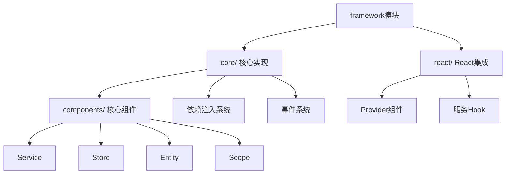
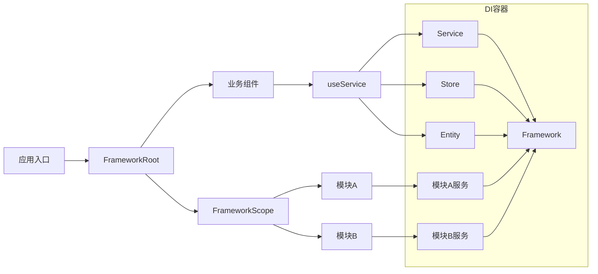

# AFFiNE Common Packages 技术备忘录

## 概述

`@packages/common` 目录包含了 AFFiNE 项目的核心基础设施组件，这些包提供了跨平台、跨模块的通用功能。本文档详细分析了各个包的技术栈、架构设计和学习路径。

## 包结构总览

```
packages/common/
├── debug/          # 调试工具包
├── env/            # 环境配置管理
├── error/          # 错误处理机制
├── graphql/        # GraphQL 客户端
├── infra/          # 基础设施框架
├── native/         # Rust 原生模块
├── nbstore/        # 存储抽象层
├── reader/         # 文档阅读器
├── theme/          # 主题系统（已迁移）
└── y-octo/         # CRDT 协作编辑
```

## 技术栈对比表

| 包名                | 主要语言   | 核心依赖             | 功能领域   | 复杂度     | 学习优先级 |
| ------------------- | ---------- | -------------------- | ---------- | ---------- | ---------- |
| @affine/debug       | TypeScript | debug                | 开发工具   | ⭐         | 高         |
| @affine/env         | TypeScript | zod                  | 环境检测   | ⭐⭐       | 高         |
| @affine/error       | TypeScript | graphql              | 错误处理   | ⭐⭐       | 高         |
| @affine/graphql     | TypeScript | graphql, codegen     | API 客户端 | ⭐⭐⭐     | 中         |
| @toeverything/infra | TypeScript | react, jotai, rxjs   | 基础框架   | ⭐⭐⭐⭐   | 中         |
| @affine/native      | Rust       | napi-rs, tree-sitter | 原生模块   | ⭐⭐⭐⭐⭐ | 低         |
| @affine/nbstore     | TypeScript | yjs, rxjs, idb       | 存储同步   | ⭐⭐⭐⭐   | 中         |
| @affine/reader      | TypeScript | yjs, blocksuite      | 文档解析   | ⭐⭐⭐     | 中         |
| y-octo              | Rust + TS  | napi-rs, yjs         | CRDT 协作  | ⭐⭐⭐⭐⭐ | 低         |

## 架构关系图

```mermaid
graph TB
    subgraph "应用层"
        APP[AFFiNE App]
        FRONTEND[Frontend Core]
    end

    subgraph "基础设施层"
        INFRA[@toeverything/infra]
        NBSTORE[@affine/nbstore]
        GRAPHQL[@affine/graphql]
    end

    subgraph "工具层"
        DEBUG[@affine/debug]
        ENV[@affine/env]
        ERROR[@affine/error]
        READER[@affine/reader]
    end

    subgraph "原生层"
        NATIVE[@affine/native]
        YOCTO[y-octo]
    end

    subgraph "外部依赖"
        YJS[Yjs]
        REACT[React 19]
        RUST[Rust Runtime]
        INDEXEDDB[IndexedDB]
        SQLITE[SQLite]
    end

    %% 应用层依赖
    APP --> FRONTEND
    FRONTEND --> INFRA
    FRONTEND --> NBSTORE
    FRONTEND --> GRAPHQL

    %% 基础设施层依赖
    INFRA --> DEBUG
    INFRA --> ENV
    INFRA --> ERROR
    INFRA --> REACT

    NBSTORE --> READER
    NBSTORE --> INFRA
    NBSTORE --> YJS
    NBSTORE --> INDEXEDDB
    NBSTORE --> SQLITE

    GRAPHQL --> DEBUG
    GRAPHQL --> ENV
    GRAPHQL --> ERROR

    %% 原生层依赖
    NATIVE --> RUST
    YOCTO --> RUST
    YOCTO --> YJS

    %% 工具层依赖
    READER --> YJS

    %% 样式
    classDef appLayer fill:#e1f5fe
    classDef infraLayer fill:#f3e5f5
    classDef toolLayer fill:#e8f5e8
    classDef nativeLayer fill:#fff3e0
    classDef externalLayer fill:#fafafa

    class APP,FRONTEND appLayer
    class INFRA,NBSTORE,GRAPHQL infraLayer
    class DEBUG,ENV,ERROR,READER toolLayer
    class NATIVE,YOCTO nativeLayer
    class YJS,REACT,RUST,INDEXEDDB,SQLITE externalLayer
```

上面的 Mermaid 图展示了各个 common packages 之间的依赖关系和分层架构：

- **应用层**：AFFiNE 应用和前端核心模块
- **基础设施层**：核心框架和存储、API 客户端
- **工具层**：调试、环境、错误处理等工具包
- **原生层**：Rust 实现的高性能模块
- **外部依赖**：第三方库和运行时环境

这种分层设计确保了：

1. 清晰的职责分离
2. 良好的可测试性
3. 模块间的松耦合
4. 易于维护和扩展

## 详细技术分析

### 1. @affine/debug - 调试工具包

**技术栈：**

- TypeScript
- debug 库（Node.js 风格的调试工具）

**核心功能：**

- 统一的调试日志接口
- 浏览器环境下的调试控制
- 基于 URL 参数和 sessionStorage 的调试开关

**关键特性：**

```typescript
// 自动检测 URL 中的 debug 参数
if (window.location.search.includes('debug')) {
  sessionStorage.setItem(SESSION_KEY, 'true');
}

// 支持构建时调试配置
if (BUILD_CONFIG.debug) {
  debug.enable('*,-micromark');
}
```

**学习要点：**

- 理解 debug 库的命名空间机制
- 掌握浏览器调试工具的集成方式
- 学习条件编译和环境变量的使用

### 2. @affine/env - 环境配置管理

**技术栈：**

- TypeScript
- Zod（运行时类型验证）
- User Agent 检测

**核心功能：**

- 跨平台环境检测（操作系统、浏览器）
- 全局环境变量管理
- PWA 和移动端检测

**架构设计：**

```typescript
interface Environment {
  isLinux: boolean;
  isMacOs: boolean;
  isSafari: boolean;
  isWindows: boolean;
  isFireFox: boolean;
  isChrome: boolean;
  isIOS: boolean;
  isPwa: boolean;
  isMobile: boolean;
  isSelfHosted: boolean;
  publicPath: string;
  subPath: string;
}
```

**学习要点：**

- User Agent 解析和浏览器检测
- 全局状态管理模式
- Meta 标签配置覆盖机制

### 3. @affine/error - 错误处理机制

**技术栈：**

- TypeScript
- GraphQL Error 扩展

**核心功能：**

- 统一的错误类型定义
- GraphQL 错误处理
- 用户友好的错误响应

**设计模式：**

```typescript
export class UserFriendlyError extends Error {
  readonly status: number;
  readonly code: string;
  readonly type: string;
  readonly name: ErrorName;
  readonly message: string;
  readonly data?: any;

  static fromAny(anything: any): UserFriendlyError;
}
```

**学习要点：**

- 错误类型系统设计
- GraphQL 错误扩展机制
- 错误转换和标准化处理

### 4. @affine/graphql - GraphQL 客户端

**技术栈：**

- TypeScript
- GraphQL
- GraphQL Code Generator
- Lodash

**核心功能：**

- 自动生成的 GraphQL 客户端
- 类型安全的查询接口
- 请求/响应处理

**代码生成配置：**

```yaml
# codegen.yml
generates:
  src/graphql/index.ts:
    plugins:
      - typescript
      - typescript-operations
```

**学习要点：**

- GraphQL Schema 到 TypeScript 的代码生成
- 类型安全的 API 客户端设计
- GraphQL 查询优化和缓存

### 5. @toeverything/infra - 基础设施框架

**技术栈：**

- TypeScript
- React 19
- Jotai（状态管理）
- RxJS
- Yjs（CRDT）
- IndexedDB

**核心模块：**

#### packages/common/infra/src/framework 模块架构分析



## 核心目录功能

| 目录/文件           | 功能说明                       |
| ------------------- | ------------------------------ |
| `core/`             | 框架核心实现                   |
| `core/framework.ts` | DI容器中枢，管理组件注册和解析 |
| `core/component.ts` | 所有组件的基类                 |
| `core/provider.ts`  | 依赖注入容器实现               |
| `core/components/`  | 核心组件类型定义               |
| `react/`            | React框架集成层                |
| `__tests__/`        | 单元测试                       |

## 核心组件类型

| 组件类型  | 功能         | 继承关系          |
| --------- | ------------ | ----------------- |
| `Service` | 业务逻辑单元 | 继承自`Component` |
| `Store`   | 状态管理     | 继承自`Component` |
| `Entity`  | 领域模型     | 继承自`Component` |
| `Scope`   | 作用域管理   | 特殊组件类型      |

## 核心类详细分析

### 1. `Framework` 类

**设计意图**：作为DI容器核心，管理组件的注册、解析和生命周期

```typescript
// 初始化示例
const framework = new Framework();

// 注册组件（三种方式）
// 1. 直接注册值
framework.addValue(LoggerService, new ConsoleLogger());

// 2. 注册工厂函数
framework.addFactory(DatabaseService, () => new MySQLDatabase());

// 3. 使用流畅API（推荐）
framework.service(AuthService, [UserRepository]).store(UserStore).entity(UserEntity);
```

### 2. `FrameworkEditor` 类

**设计意图**：提供类型安全的流畅API简化组件注册

```typescript
const editor = new FrameworkEditor(framework);

// 注册服务（自动处理依赖）
editor.service(NotificationService, [LoggerService, EmailService]);

// 注册带依赖的存储
editor.store(UserStore, [UserRepository, LoggerService]);

// 设置作用域
editor.scope(UserScope).service(UserService);

// 覆盖现有实现
editor.override(LoggerService, new CustomLogger());
```

### 3. `Component` 基类

**设计意图**：提供组件的统一生命周期管理

```typescript
class CustomService extends Component {
  constructor() {
    super(); // 自动注入framework和props

    // 注册资源清理回调
    this.disposables.push(() => {
      console.log('Cleaning up resources');
    });
  }

  // 组件生命周期方法
  async initialize() {
    // 初始化逻辑
  }

  dispose() {
    super.dispose(); // 调用父类清理
    // 自定义清理逻辑
  }
}
```

### 4. `Service` 组件

**设计意图**：封装可复用的业务逻辑单元

```typescript
class PaymentService extends Service {
  constructor(
    private paymentGateway: PaymentGatewayService,
    private logger: LoggerService
  ) {
    super();
  }

  processPayment(amount: number) {
    this.logger.log(`Processing $${amount} payment`);
    return this.paymentGateway.charge(amount);
  }
}

// 注册服务
framework.service(PaymentService, [PaymentGatewayService, LoggerService]);
```

### 5. 作用域系统

**设计意图**：实现环境隔离和配置覆盖

```typescript
// 定义作用域
const AdminScope = createScope('admin');

// 注册全局服务
framework.service(LoggerService, () => new ConsoleLogger());

// 在admin作用域覆盖实现
framework.scope(AdminScope).override(LoggerService, () => new FileLogger('/var/log/admin.log'));

// 创建作用域provider
const adminProvider = framework.provider([AdminScope]);
```

## React集成分析

### 核心组件和Hook

`react/index.tsx`文件提供React上下文集成：

```tsx
import { FrameworkRoot, useService } from '@affine/infra/framework/react';

function App() {
  return (
    <FrameworkRoot framework={framework}>
      <ChildComponent />
    </FrameworkRoot>
  );
}

function ChildComponent() {
  const logger = useService(LoggerService);
  logger.log('Rendered');
  return <div>Hello</div>;
}
```

### 作用域隔离实现

**设计意图**：实现功能模块的配置隔离

```tsx
function AdminPanel() {
  return (
    <FrameworkScope scope={AdminScope}>
      <AdminDashboard />
    </FrameworkScope>
  );
}

function AdminDashboard() {
  // 获取的是AdminScope作用域覆盖后的LoggerService
  const logger = useService(LoggerService);

  useEffect(() => {
    logger.log('Admin dashboard mounted');
  }, []);

  return <div>Admin Area</div>;
}
```

## 设计模式与架构思想

### 1. 依赖注入(DI)

- 使用标识符解耦依赖
- 支持构造函数注入
- 分层作用域系统

### 2. 组件生命周期

- 通过`dispose()`管理资源清理
- 自动垃圾回收
- 资源释放回调机制

### 3. 事件系统

- 通过`eventBus`实现组件通信
- 所有组件可通过`this.eventBus`访问
- 松耦合的组件交互

## 完整架构图



## 使用示例集合

### 基础使用

```typescript
// 服务定义
class LoggerService extends Service {
  log(message: string) {
    console.log(message);
  }
}

// 框架初始化
const framework = new Framework();
framework.impl(LoggerService);

// 获取服务实例
const logger = framework.provider().get(LoggerService);
logger.log('Hello Framework!');
```

### 作用域使用

```typescript
// 用户作用域
const UserScope = createScope('user');

// 在用户作用域注册服务
framework.scope(UserScope).service(UserService, [UserRepository]);

// 创建用户作用域provider
const userProvider = framework.provider([UserScope]);
const userService = userProvider.get(UserService);
```

### React集成

```tsx
import { FrameworkRoot, useServices } from '@affine/infra/framework/react';

function ShoppingCart() {
  const { cartService, paymentService } = useServices({
    CartService,
    PaymentService,
  });

  const checkout = () => {
    paymentService.processPayment(cartService.total);
  };

  return (
    <div>
      <button onClick={checkout}>Checkout</button>
    </div>
  );
}
```

#### 5.1 Operation Pattern (Op)

```typescript
interface OpSchema {
  [key: string]: [any, any]; // [input, output]
}

interface Ops extends OpSchema {
  add: [{ a: number; b: number }, number];
  subscribeStatus: [number, string];
}
```

**特点：**

- 类型安全的 RPC 框架
- 支持 Worker、SharedWorker、BroadcastChannel
- 函数调用和流式处理

#### 5.2 Atom 状态管理

- 基于 Jotai 的响应式状态管理
- 支持异步状态和副作用
- 与 React 深度集成

#### 5.3 Storage 抽象

- 统一的存储接口
- 支持 IndexedDB、内存存储
- 版本迁移和数据同步

**学习要点：**

- 现代 React 状态管理模式
- RPC 框架设计原理
- 存储抽象和数据持久化

### 6. @affine/native - Rust 原生模块

**技术栈：**

- Rust 2021 Edition
- NAPI-RS（Node.js 原生模块绑定）
- Tree-sitter（代码解析）
- 文档处理库（PDF、DOCX 等）

**功能特性：**

```toml
[features]
default = []
doc-loader = [
  "docx-parser", "pdf-extract",
  "readability", "text-splitter"
]
tree-sitter = [
  "tree-sitter-javascript",
  "tree-sitter-typescript",
  "tree-sitter-rust",
  # ... 更多语言支持
]
```

**学习要点：**

- Rust 与 Node.js 的互操作
- 文档解析和内容提取
- 代码语法分析和处理
- 性能优化和内存管理

### 7. @affine/nbstore - 存储抽象层

**技术栈：**

- TypeScript
- Yjs（CRDT）
- RxJS
- IndexedDB
- SQLite（通过 native 模块）

**架构设计：**

```typescript
interface DocStorage {
  connect(): Promise<void>;
  getDoc(docId: string): Promise<DocRecord | null>;
  setDoc(doc: DocRecord): Promise<void>;
  deleteDoc(docId: string): Promise<void>;
  subscribeDocUpdate(docId: string): Observable<DocUpdate>;
}
```

**存储实现：**

- IndexedDBDocStorage - 浏览器本地存储
- SqliteBlobStorage - 桌面端 SQLite 存储
- CloudDocStorage - 云端同步存储
- BroadcastChannelStorage - 跨标签页同步

**学习要点：**

- 存储抽象层设计
- CRDT 数据同步机制
- 多端存储策略
- 实时数据同步

### 8. @affine/reader - 文档阅读器

**技术栈：**

- TypeScript
- Yjs
- BlockSuite 格式解析

**核心功能：**

```typescript
// 读取根文档
const docs = readAllDocsFromRootDoc(rootDoc);

// 读取文档块
const blocks = readAllBlocksFromDoc(doc);
```

**学习要点：**

- BlockSuite 文档格式理解
- Yjs 文档结构解析
- 文档内容提取和转换

### 9. @affine/theme - 主题系统

**状态：** 已迁移到 [toeverything/design](https://github.com/toeverything/design)

**学习要点：**

- 设计系统的模块化管理
- 主题切换和持久化
- CSS-in-JS 和设计令牌

### 10. y-octo - CRDT 协作编辑

**技术栈：**

- Rust（核心 CRDT 实现）
- NAPI-RS（Node.js 绑定）
- TypeScript（API 封装）

**核心特性：**

- 高性能 CRDT 实现
- Yjs 兼容性
- 多线程安全
- 模糊测试和内存安全检查

**架构组件：**

- `y-octo/core` - Rust 核心库
- `y-octo/node` - Node.js 绑定
- `y-octo/utils` - 工具函数

**学习要点：**

- CRDT 算法原理
- Rust 高性能编程
- 跨语言模块开发
- 协作编辑系统设计

## 快速入门指南

### 环境准备

1. **开发环境要求**

   ```bash
   # Node.js 版本要求
   node --version  # >= 18.0.0

   # 包管理器
   yarn --version  # 推荐使用 yarn

   # Rust 环境（用于原生模块开发）
   rustc --version  # >= 1.70.0
   ```

2. **项目设置**

   ```bash
   # 克隆项目
   git clone https://github.com/toeverything/AFFiNE.git
   cd AFFiNE

   # 安装依赖
   yarn install

   # 构建 common packages
   yarn build:packages
   ```

3. **开发工具配置**
   - VS Code + Rust Analyzer 扩展
   - TypeScript 严格模式
   - ESLint + Prettier 代码格式化

### 第一个示例：使用调试工具

```typescript
// 1. 引入调试工具
import { DebugLogger } from '@affine/debug';

// 2. 创建调试器实例
const logger = new DebugLogger('MyModule');

// 3. 使用调试功能
logger.info('Application started');
logger.warn('This is a warning');
logger.error('Error occurred', error);

// 4. 在浏览器中启用调试
// 访问 http://localhost:3000/?debug
// 或在控制台执行: sessionStorage.setItem('affine:debug', 'true')
```

### 第二个示例：环境检测

```typescript
// 1. 初始化环境
import { setupGlobal } from '@affine/env/global';
setupGlobal();

// 2. 使用环境信息
const env = globalThis.environment;

// 3. 平台特定逻辑
if (env.isMobile) {
  console.log('移动端环境');
} else if (env.isDesktop) {
  console.log('桌面端环境');
}

// 4. 浏览器特定功能
if (env.isChrome && env.chromeVersion >= 90) {
  // 使用现代 Chrome 功能
}
```

## 学习路径建议

### 初级阶段（1-2 周）

1. **环境配置和调试**

   - 学习 `@affine/env` 的环境检测机制
   - 掌握 `@affine/debug` 的调试工具使用
   - 理解构建配置和环境变量

2. **错误处理**
   - 学习 `@affine/error` 的错误类型系统
   - 掌握统一错误处理模式
   - 理解 GraphQL 错误扩展

### 中级阶段（2-4 周）

3. **基础设施框架**

   - 深入学习 `@toeverything/infra` 的架构
   - 掌握 Operation Pattern 的 RPC 设计
   - 学习 Jotai 状态管理模式
   - 理解存储抽象层设计

4. **GraphQL 集成**
   - 学习 `@affine/graphql` 的代码生成
   - 掌握类型安全的 API 客户端
   - 理解 GraphQL 最佳实践

### 高级阶段（4-8 周）

5. **存储和同步**

   - 深入学习 `@affine/nbstore` 的存储抽象
   - 掌握多端数据同步机制
   - 理解 CRDT 数据结构

6. **原生模块开发**

   - 学习 `@affine/native` 的 Rust 开发
   - 掌握 NAPI-RS 的使用
   - 理解文档处理和代码解析

7. **协作编辑**
   - 深入学习 `y-octo` 的 CRDT 实现
   - 掌握实时协作算法
   - 理解冲突解决机制

## 开发实践指南

### 1. 包依赖管理

**依赖关系图：**

```
@toeverything/infra
├── @affine/debug
├── @affine/env
├── @affine/error
└── @affine/templates

@affine/nbstore
├── @affine/reader
├── @toeverything/infra
└── yjs

@affine/graphql
├── @affine/debug
├── @affine/env
└── @affine/error
```

### 2. 开发工具配置

**TypeScript 配置：**

- 所有包都使用严格的 TypeScript 配置
- 支持 ES 模块和现代 JavaScript 特性
- 统一的构建和测试配置

**测试策略：**

- 使用 Vitest 进行单元测试
- Rust 代码使用 Cargo 测试框架
- 集成测试覆盖跨包交互

### 3. 性能优化

**关键优化点：**

- 使用 Tree Shaking 减少包体积
- 懒加载和代码分割
- 原生模块优化关键路径
- 内存管理和垃圾回收优化

## 常见问题和解决方案

### 1. 包版本同步问题

- 使用 workspace 协议管理内部依赖
- 统一版本号管理策略

### 2. 类型安全问题

- 严格的 TypeScript 配置
- 运行时类型验证（Zod）
- 代码生成保证类型一致性

### 3. 性能瓶颈

- 使用 Rust 优化计算密集型任务
- 合理的缓存策略
- 异步处理和流式数据

## 实际开发示例

### 使用 Operation Pattern 创建 RPC 服务

```typescript
// 定义操作接口
interface MyOps extends OpSchema {
  calculateSum: [{ numbers: number[] }, number];
  subscribeProgress: [string, number];
}

// 服务端实现
const consumer = new OpConsumer<MyOps>();
consumer.register('calculateSum', ({ numbers }) => {
  return numbers.reduce((sum, num) => sum + num, 0);
});

consumer.register('subscribeProgress', function* (taskId) {
  for (let i = 0; i <= 100; i += 10) {
    yield i;
    // 模拟进度更新
    await new Promise(resolve => setTimeout(resolve, 100));
  }
});

// 客户端调用
const client = new OpClient<MyOps>();
const sum = await client.call('calculateSum', { numbers: [1, 2, 3, 4, 5] });

// 订阅流式数据
client.subscribe('subscribeProgress', 'task-1').subscribe(progress => {
  console.log(`Progress: ${progress}%`);
});
```

### 使用 NBStore 进行数据存储

```typescript
import { SpaceStorage } from '@affine/nbstore';
import { IndexedDBDocStorage } from '@affine/nbstore/idb';

// 创建存储实例
const storage = new SpaceStorage([
  new IndexedDBDocStorage({
    peer: 'local',
    spaceId: 'my-workspace',
  }),
]);

// 连接存储
await storage.connect();

// 监听连接状态
storage.on('connection', ({ storage, status, error }) => {
  console.log(`Storage ${storage.peer} status: ${status}`);
  if (error) console.error(error);
});

// 存储文档
const docData = new Uint8Array([
  /* Yjs 文档数据 */
]);
await storage.setDoc({
  docId: 'doc-1',
  bin: docData,
  timestamp: new Date(),
  editor: 'user-1',
});

// 读取文档
const doc = await storage.getDoc('doc-1');
if (doc) {
  console.log('Document loaded:', doc);
}
```

### 使用环境检测

```typescript
import { setupGlobal } from '@affine/env/global';

// 初始化全局环境
setupGlobal();

// 使用环境信息
if (globalThis.environment.isMobile) {
  // 移动端特定逻辑
  console.log('Running on mobile device');
}

if (globalThis.environment.isChrome) {
  // Chrome 特定功能
  console.log(`Chrome version: ${globalThis.environment.chromeVersion}`);
}

// 检测 PWA 环境
if (globalThis.environment.isPwa) {
  // PWA 特定功能
  console.log('Running as PWA');
}
```

## 总结

AFFiNE 的 common packages 体现了现代前端工程的最佳实践：

1. **模块化设计** - 每个包职责单一，接口清晰
2. **类型安全** - 全面的 TypeScript 支持和运行时验证
3. **性能优化** - Rust 原生模块和高效的数据结构
4. **跨平台支持** - 统一的抽象层支持多种运行环境
5. **开发体验** - 完善的工具链和调试支持

通过系统学习这些包的设计和实现，可以深入理解现代 Web 应用的架构模式和技术选型。建议按照学习路径逐步深入，结合实际项目需求进行实践。

## 参考资源

### 官方文档

- [Y-Octo GitHub](https://github.com/toeverything/y-octo)
- [AFFiNE 项目主页](https://affine.pro)
- [BlockSuite 文档](https://blocksuite.io)

### 技术栈学习资源

- [Rust 官方教程](https://doc.rust-lang.org/book/)
- [NAPI-RS 文档](https://napi.rs/)
- [Jotai 状态管理](https://jotai.org/)
- [GraphQL 最佳实践](https://graphql.org/learn/best-practices/)
- [CRDT 算法介绍](https://crdt.tech/)

### 开发工具

- [TypeScript 配置参考](https://www.typescriptlang.org/tsconfig)
- [Vitest 测试框架](https://vitest.dev/)
- [GraphQL Code Generator](https://the-guild.dev/graphql/codegen)
