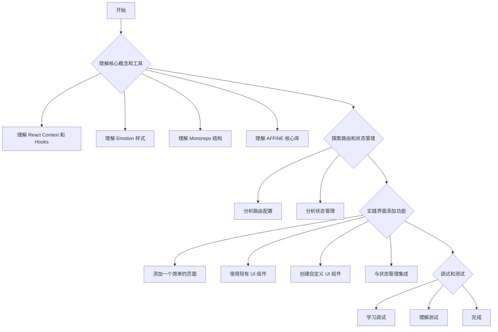

# AFFiNE Web 应用学习计划

本计划旨在帮助您系统地学习 AFFiNE Web 应用的结构和开发流程，从而能够有效地调整界面和添加新功能。

## 阶段 1: 理解核心概念和工具

1.  **深入理解 React Context 和 Hooks**:
    - **目标**: 掌握 React Context API 的使用，特别是 `AffineContext` 如何在整个应用中共享状态。理解 `useContext`、`useState`、`useEffect` 等 Hooks 的基本用法和高级模式。
    - **学习资源**: React 官方文档，特别是关于 Context 和 Hooks 的部分。
2.  **理解 Emotion 样式**:
    - **目标**: 了解 Emotion 的基本用法，包括 `css` prop、`styled` 组件以及如何使用 `.css.ts` 文件进行样式定义。
    - **学习资源**: Emotion 官方文档。
3.  **理解 Monorepo 结构**:
    - **目标**: 了解 Yarn Workspaces 或类似的 Monorepo 工具如何管理多个包，以及包之间的依赖关系。
    - **学习资源**: Yarn Workspaces 文档，或相关 Monorepo 最佳实践。
4.  **理解 AFFiNE 核心库 (`@affine/core`, `@toeverything/infra`, `@affine/component`)**:
    - **目标**: 粗略浏览这些包的 `src` 目录，了解其主要功能和模块划分。特别是关注 `packages/frontend/core/src/modules` 下的各个模块，以及 `packages/frontend/component/src/ui` 下的通用 UI 组件。
    - **行动**:
      - 阅读 `packages/frontend/core/src/modules/index.ts` 来了解模块的注册方式。
      - 阅读 `packages/frontend/component/src/index.ts` 来了解通用组件的导出方式。

## 阶段 2: 探索路由和状态管理

1.  **分析路由配置**:
    - **目标**: 找到 `router` 对象的具体定义，理解 AFFiNE 的路由结构（例如，是否使用嵌套路由、路由参数、路由守卫等）。
    - **行动**: 搜索 `packages/frontend/core/desktop/router` 目录下的文件，找到 `router` 对象的定义。
    - **预期结果**: 能够识别路由定义文件，并理解如何添加新的路由路径和对应的组件。
2.  **分析状态管理**:
    - **目标**: 找到 `getCurrentStore()` 的具体实现，理解 AFFiNE 的状态管理模式（例如，是否基于 MobX, Zustand, Redux 等）。了解如何定义新的状态、如何修改状态以及如何订阅状态变化。
    - **行动**: 搜索 `@toeverything/infra` 包中的 `getCurrentStore` 定义。这可能需要进一步探索 `packages/infra` 目录。
    - **预期结果**: 能够识别状态管理的核心文件，并理解如何与全局状态进行交互。

## 阶段 3: 实践界面添加功能

1.  **添加一个简单的页面**:
    - **目标**: 创建一个新的 React 组件，并将其注册到路由中，使其可以通过 URL 访问。
    - **行动**:
      - 在 `packages/frontend/apps/web/src/pages` (如果存在，否则创建) 或 `packages/frontend/core/src/modules/your-new-feature/views` (更符合模块化设计) 下创建一个新的 `.tsx` 文件，例如 `NewFeaturePage.tsx`。
      - 在路由配置文件中添加一个新的路由条目，将新组件与一个 URL 路径关联起来。
      - 在 `app.tsx` 或相关导航组件中添加一个链接，以便导航到新页面。
    - **预期结果**: 能够成功访问新创建的页面。
2.  **使用现有 UI 组件**:
    - **目标**: 在新页面或现有页面中，使用 `packages/frontend/component/src/ui` 下的现有 UI 组件（例如 `Button`, `Input`, `Modal` 等）来构建界面。
    - **行动**: 导入并使用这些组件，观察它们如何与 Emotion 样式协同工作。
    - **预期结果**: 能够熟练使用 AFFiNE 的 UI 组件库。
3.  **创建自定义 UI 组件**:
    - **目标**: 如果现有组件无法满足需求，学习如何创建符合 AFFiNE 样式规范的新 UI 组件。
    - **行动**:
      - 在 `packages/frontend/component/src/ui/your-new-component` 下创建新的组件文件 (`.tsx`) 和样式文件 (`.css.ts`)。
      - 遵循现有组件的命名和组织约定。
    - **预期结果**: 能够创建并集成自定义 UI 组件。
4.  **与状态管理集成**:
    - **目标**: 让新功能能够读取和修改应用程序的全局状态。
    - **行动**: 根据对状态管理模式的理解，在新组件中获取或更新相关状态。
    - **预期结果**: 新功能能够与应用程序的数据层进行有效交互。

## 阶段 4: 调试和测试

1.  **学习调试**:
    - **目标**: 掌握在浏览器中调试 React 应用程序的基本技巧，例如使用 React Developer Tools 和浏览器开发者工具。
    - **行动**: 在开发过程中使用调试工具来检查组件状态、Props 和渲染过程。
2.  **理解测试**:
    - **目标**: 了解项目中的测试框架（`vitest` 和 `playwright`），并学习如何编写简单的单元测试和端到端测试来验证新功能。
    - **行动**: 查阅 `tests/` 目录下的现有测试用例。

## 学习路径可视化

