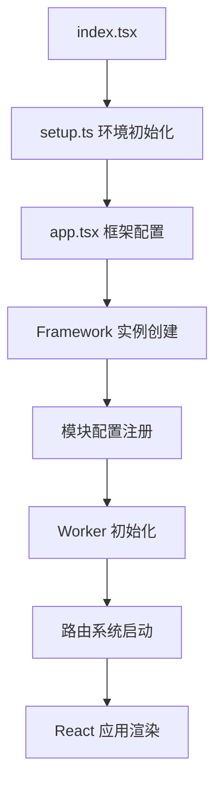
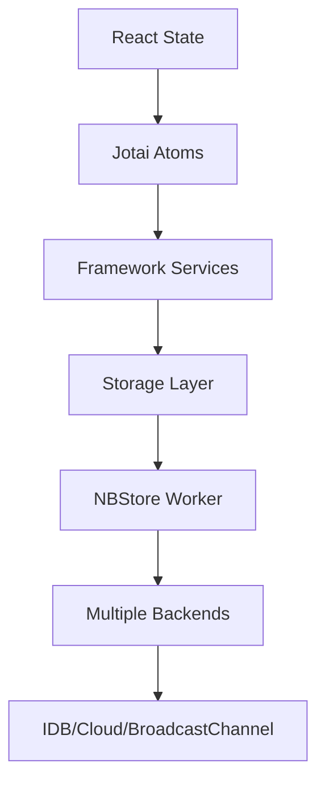

# AFFiNE Web 模块架构技术说明

## 1. 项目概述

`packages/frontend/apps/web` 是 AFFiNE 的桌面版 Web 应用，作为整个前端架构的核心入口点，负责将各个功能模块整合成完整的用户界面应用。

### 1.1 项目定位

- **应用类型**: 桌面版 Web 应用（Desktop Web Application）
- **技术架构**: 基于 React 19 + TypeScript 的现代化 SPA
- **构建目标**: 支持浏览器和 Electron 双平台运行
- **版本**: 0.21.0

### 1.2 核心特性

- 🚀 **现代化技术栈**: React 19、TypeScript 5.7、Emotion CSS-in-JS
- 🏗️ **模块化架构**: 基于 @toeverything/infra 框架的依赖注入系统
- 🔄 **多层状态管理**: 集成 Jotai、自定义存储和 React 状态
- 🎨 **主题系统**: 支持深色/浅色主题切换和自定义主题
- 📱 **响应式设计**: 支持多平台适配（Web/Electron/Mobile）
- ⚡ **性能优化**: 代码分割、懒加载、Worker 多线程

## 2. 目录结构与文件组织

```
packages/frontend/apps/web/
├── src/                    # 源码目录
│   ├── app.tsx            # 应用主组件
│   ├── index.tsx          # 应用入口点
│   ├── setup.ts           # 环境初始化
│   └── nbstore.worker.ts  # 存储 Worker
├── dist/                  # 构建产物
│   ├── js/               # JavaScript 文件
│   ├── assets/           # 静态资源
│   ├── fonts/            # 字体文件
│   ├── imgs/             # 图片资源
│   └── index.html        # HTML 模板
├── package.json          # 项目配置
├── tsconfig.json         # TypeScript 配置
└── README.md             # 项目说明
```

### 2.1 核心文件功能

#### `src/index.tsx` - 应用入口点

```typescript
// 应用挂载逻辑
function mountApp() {
  const root = document.getElementById('app')!;
  createRoot(root).render(
    <StrictMode>
      <Telemetry />  // 遥测组件
      <App />        // 主应用组件
    </StrictMode>
  );
}
```

#### `src/app.tsx` - 应用主组件

- 框架初始化和依赖注入配置
- 多 Worker 支持（SharedWorker/Worker）
- 路由系统集成
- 全局上下文提供

#### `src/setup.ts` - 环境初始化

- 浏览器环境引导
- 清理任务配置
- 主题系统初始化

#### `src/nbstore.worker.ts` - 存储 Worker

- 多存储后端集成（IDB、BroadcastChannel、Cloud）
- 后台数据处理
- 跨标签页数据同步

## 3. 技术栈与依赖关系

### 3.1 核心技术栈

| 技术         | 版本    | 用途      |
| ------------ | ------- | --------- |
| React        | 19.0.0  | UI 框架   |
| TypeScript   | 5.7.2   | 类型系统  |
| React Router | 6.28.0  | 路由管理  |
| Emotion      | 11.14.0 | CSS-in-JS |
| Sentry       | 9.2.0   | 错误监控  |

### 3.2 内部依赖模块

```typescript
// 核心模块依赖
"@affine/component": "workspace:*",    // UI 组件库
"@affine/core": "workspace:*",         // 核心业务逻辑
"@affine/env": "workspace:*",          // 环境配置
"@affine/i18n": "workspace:*",         // 国际化
"@affine/nbstore": "workspace:*",      // 存储系统
"@affine/track": "workspace:*",        // 用户行为追踪
"@toeverything/infra": "workspace:*"   // 基础设施框架
```

### 3.3 构建工具链

- **构建工具**: 自定义 Webpack 配置（通过 `affine bundle`）
- **开发服务器**: Webpack Dev Server
- **代码检查**: ESLint + Prettier
- **类型检查**: TypeScript Compiler
- **测试框架**: Vitest + Playwright

## 4. 应用启动与初始化流程

### 4.1 启动流程图



### 4.2 框架初始化过程

```typescript
// 1. 创建应用框架实例
const framework = new Framework();

// 2. 配置核心模块
configureCommonModules(framework); // 通用模块
configureBrowserWorkbenchModule(framework); // 浏览器工作台
configureLocalStorageStateStorageImpls(framework); // 本地存储
configureBrowserWorkspaceFlavours(framework); // 工作区类型

// 3. 注册服务提供者
framework.impl(NbstoreProvider, { openStore });
framework.impl(PopupWindowProvider, { open });

// 4. 启动应用生命周期
frameworkProvider.get(LifecycleService).applicationStart();
```

### 4.3 Worker 多线程架构

```typescript
// SharedWorker 优先策略
if (window.SharedWorker && localStorage.getItem('disableSharedWorker') !== 'true') {
  // 多标签页共享 Worker
  const worker = new SharedWorker(workerUrl, {
    name: 'affine-shared-worker',
  });
  storeManagerClient = new StoreManagerClient(new OpClient(worker.port));
} else {
  // 回退到普通 Worker
  const worker = new Worker(workerUrl);
  storeManagerClient = new StoreManagerClient(new OpClient(worker));
}
```

## 5. 路由系统与页面结构

### 5.1 路由配置架构

路由系统基于 React Router v6，采用懒加载和代码分割策略：

```typescript
export const topLevelRoutes = [
  {
    element: <RootRouter />,
    errorElement: <AffineErrorComponent />,
    children: [
      { path: '/', lazy: () => import('./pages/index') },
      { path: '/workspace/:workspaceId/*', lazy: () => import('./pages/workspace/index') },
      { path: '/auth/:authType', lazy: () => import('./pages/auth/auth') },
      // ... 更多路由
    ],
  },
];
```

### 5.2 主要页面结构

| 路由路径           | 组件            | 功能描述        |
| ------------------ | --------------- | --------------- |
| `/`                | pages/index     | 首页/工作区列表 |
| `/workspace/:id/*` | pages/workspace | 工作区主界面    |
| `/auth/:type`      | pages/auth      | 用户认证        |
| `/invite/:id`      | pages/invite    | 邀请页面        |
| `/404`             | pages/404       | 错误页面        |

### 5.3 懒加载机制

```typescript
// 使用 Webpack 魔法注释进行代码分割
{
  path: '/auth/:authType',
  lazy: () => import(/* webpackChunkName: "auth" */ './pages/auth/auth'),
}
```

## 6. 状态管理架构

### 6.1 多层状态管理设计

AFFiNE Web 应用采用多层状态管理架构，各层职责明确：



#### 状态层级说明

1. **React State**: 组件局部状态，处理 UI 交互
2. **Jotai Atoms**: 全局原子化状态，细粒度更新
3. **Framework Services**: 业务逻辑服务，依赖注入管理
4. **Storage Layer**: 统一存储抽象层
5. **NBStore Worker**: 后台存储处理，多线程优化
6. **Multiple Backends**: 多存储后端，数据持久化

### 6.2 核心状态管理组件

#### AffineContext - 全局上下文

```typescript
<AffineContext store={getCurrentStore()}>
  {/* 提供全局 Jotai Store 实例 */}
  <RouterProvider router={router} />
</AffineContext>
```

#### FrameworkRoot - 依赖注入根节点

```typescript
<FrameworkRoot framework={frameworkProvider}>
  {/* 提供服务依赖注入容器 */}
  <CacheProvider value={cache}>
    <I18nProvider>
      {/* 应用组件树 */}
    </I18nProvider>
  </CacheProvider>
</FrameworkRoot>
```

### 6.3 存储系统集成

#### NBStore Worker 配置

```typescript
const consumer = new StoreManagerConsumer([
  ...idbStorages, // IndexedDB 存储
  ...idbV1Storages, // 兼容性存储
  ...broadcastChannelStorages, // 跨标签页同步
  ...cloudStorages, // 云端存储
]);
```

#### 存储提供者注册

```typescript
framework.impl(NbstoreProvider, {
  openStore(key, options) {
    return storeManagerClient.open(key, options);
  },
});
```

## 7. 样式系统与主题

### 7.1 CSS-in-JS 方案

#### Emotion 配置

```typescript
// 创建样式缓存实例，支持样式隔离
const cache = createEmotionCache();

// 在应用根节点提供缓存
<CacheProvider value={cache}>
  {/* 应用组件 */}
</CacheProvider>
```

#### Vanilla Extract 集成

- 零运行时 CSS-in-JS 解决方案
- 类型安全的样式定义
- 构建时样式提取和优化

### 7.2 主题系统设计

#### 主题提供者架构

```typescript
// 主题观察者组件
function ThemeObserver() {
  const { resolvedTheme } = useTheme();
  const service = useService(AppThemeService);

  useEffect(() => {
    service.appTheme.theme$.next(resolvedTheme);
  }, [resolvedTheme, service.appTheme.theme$]);

  return null;
}
```

#### 支持的主题类型

```typescript
const themes = ['dark', 'light'];
```

### 7.3 响应式设计

#### 平台适配策略

```typescript
// 根据构建配置选择布局组件
const LayoutComponent = BUILD_CONFIG.isElectron ? DesktopLayout : BrowserLayout;
```

#### 移动端适配

```css
/* 移动端安全区域适配 */
:root {
  --app-tab-height: BUILD_CONFIG.isIOS ? '49px': '62px';
  --app-tab-safe-area: calc(var(--app-tab-height) + env(safe-area-inset-bottom));
}
```

## 8. 构建配置与优化

### 8.1 Webpack 配置分析

#### 基础配置

```javascript
const config = {
  target: ['web', 'es2022'],
  mode: buildConfig.debug ? 'development' : 'production',
  devtool: buildConfig.debug ? 'cheap-module-source-map' : 'source-map',
  experiments: {
    topLevelAwait: true,
    outputModule: false,
    syncWebAssembly: true,
  },
};
```

#### 输出配置

```javascript
output: {
  filename: buildConfig.debug
    ? 'js/[name].js'
    : 'js/[name].[contenthash:8].js',
  assetModuleFilename: buildConfig.debug
    ? '[name].[contenthash:8][ext]'
    : 'assets/[name].[contenthash:8][ext][query]',
  publicPath: '/',
}
```

### 8.2 性能优化策略

#### 代码分割配置

```javascript
splitChunks: {
  maxInitialRequests: Infinity,
  chunks: 'all',
  cacheGroups: {
    defaultVendors: {
      test: /[\\/]node_modules[\\/](?!.*vanilla-extract)/,
      priority: -10,
      reuseExistingChunk: true,
    },
    styles: {
      name: 'styles',
      type: 'css/mini-extract',
      chunks: 'all',
      enforce: true,
    },
  },
}
```

#### Worker 优化

```javascript
// Worker 专用构建配置
{
  target: ['webworker', 'es2022'],
  output: {
    filename: `js/${workerName}-${buildConfig.appVersion}.worker.js`,
    globalObject: 'globalThis',
  },
}
```

### 8.3 构建产物分析

#### 主要文件类型

- **JavaScript**: 主应用代码和 Worker 文件
- **CSS**: 提取的样式文件（生产环境）
- **Assets**: 图片、字体等静态资源
- **HTML**: 应用入口模板

#### 缓存策略

- 内容哈希命名：`[name].[contenthash:8].js`
- 长期缓存：静态资源版本控制
- 增量更新：仅更新变化的文件

## 9. 开发工具与调试

### 9.1 开发环境配置

#### 开发命令

```bash
# 开发模式启动
yarn dev
# 等价于: affine bundle --dev

# 生产构建
yarn build
# 等价于: affine bundle
```

#### TypeScript 配置

```json
{
  "extends": "../../../../tsconfig.web.json",
  "compilerOptions": {
    "rootDir": "./src",
    "outDir": "./dist",
    "tsBuildInfoFile": "./dist/tsconfig.tsbuildinfo"
  },
  "references": [
    { "path": "../../component" },
    { "path": "../../core" },
    { "path": "../../../common/env" }
    // ... 更多项目引用
  ]
}
```

### 9.2 调试工具集成

#### Sentry 错误监控

```typescript
// 生产环境错误追踪
const createBrowserRouter = window.SENTRY_RELEASE ? wrapCreateBrowserRouterV6(reactRouterCreateBrowserRouter) : reactRouterCreateBrowserRouter;
```

#### 开发者工具

- **React DevTools**: 组件树调试
- **Redux DevTools**: 状态管理调试（通过 Jotai 集成）
- **Webpack Bundle Analyzer**: 构建产物分析
- **Source Maps**: 源码映射调试

### 9.3 测试配置

#### Vitest 配置

```typescript
export default defineConfig({
  plugins: [vanillaExtractPlugin(), swc.vite()],
  test: {
    browser: {
      enabled: true,
      name: 'chromium',
      provider: 'playwright',
    },
    coverage: {
      provider: 'istanbul',
      reporter: ['lcov'],
    },
  },
});
```

#### 测试策略

- **单元测试**: 组件和工具函数测试
- **集成测试**: 模块间交互测试
- **端到端测试**: 用户流程测试（Playwright）

## 10. 最佳实践与开发指南

### 10.1 编码规范

#### 命名约定

```typescript
// 组件命名：PascalCase
export const UserProfile = () => {
  /* ... */
};

// 变量/函数命名：camelCase
const getUserData = async () => {
  /* ... */
};

// 常量命名：UPPER_SNAKE_CASE
const API_BASE_URL = 'https://api.example.com';

// 类型命名：PascalCase
interface UserData {
  id: string;
  name: string;
}
```

#### 导入排序

```typescript
// 1. 外部库
import React from 'react';
import { useNavigate } from 'react-router-dom';

// 2. 内部模块（按字母顺序）
import { Button } from '@affine/component';
import { useService } from '@toeverything/infra';

// 3. 相对导入
import './styles.css';
```

### 10.2 组件开发模式

#### 函数组件模式

```typescript
interface Props {
  title: string;
  onAction?: () => void;
}

export const MyComponent: React.FC<Props> = ({ title, onAction }) => {
  const [state, setState] = useState(false);

  return (
    <div>
      <h1>{title}</h1>
      <button onClick={onAction}>Action</button>
    </div>
  );
};
```

#### 服务集成模式

```typescript
export const ServiceComponent = () => {
  const authService = useService(AuthService);
  const isLoggedIn = useLiveData(authService.session.status$);

  return (
    <div>
      {isLoggedIn ? <Dashboard /> : <LoginForm />}
    </div>
  );
};
```

### 10.3 性能优化建议

#### 组件优化

```typescript
// 使用 React.memo 避免不必要的重渲染
export const ExpensiveComponent = React.memo(({ data }) => {
  return <ComplexVisualization data={data} />;
});

// 使用 useMemo 缓存计算结果
const processedData = useMemo(() => {
  return expensiveCalculation(rawData);
}, [rawData]);

// 使用 useCallback 缓存函数引用
const handleClick = useCallback(() => {
  onAction(id);
}, [onAction, id]);
```

#### 懒加载最佳实践

```typescript
// 路由级别懒加载
const LazyPage = lazy(() => import('./pages/LazyPage'));

// 组件级别懒加载
const LazyComponent = lazy(() =>
  import('./components/HeavyComponent').then(module => ({
    default: module.HeavyComponent,
  }))
);
```

### 10.4 错误处理模式

#### 错误边界

```typescript
class ErrorBoundary extends React.Component {
  constructor(props) {
    super(props);
    this.state = { hasError: false };
  }

  static getDerivedStateFromError(error) {
    return { hasError: true };
  }

  componentDidCatch(error, errorInfo) {
    console.error('Error caught by boundary:', error, errorInfo);
  }

  render() {
    if (this.state.hasError) {
      return <ErrorFallback />;
    }
    return this.props.children;
  }
}
```

#### 异步错误处理

```typescript
const fetchData = async () => {
  try {
    const response = await api.getData();
    return response.data;
  } catch (error) {
    console.error('Failed to fetch data:', error);
    throw new Error('Data fetch failed');
  }
};
```

## 11. 与其他模块的集成

### 11.1 Core 模块集成

Web 应用通过 `@affine/core` 模块获得完整的业务功能：

```typescript
// 核心组件导入
import { AffineContext } from '@affine/core/components/context';
import { AppContainer } from '@affine/core/desktop/components/app-container';
import { router } from '@affine/core/desktop/router';

// 模块配置导入
import { configureCommonModules } from '@affine/core/modules';
import { configureBrowserWorkbenchModule } from '@affine/core/modules/workbench';
```

### 11.2 Component 模块集成

UI 组件通过 `@affine/component` 模块提供：

```typescript
import { Button, Menu, MenuItem } from '@affine/component';
import { BrowserWarning, LocalDemoTips } from '@affine/component/affine-banner';
```

### 11.3 Infrastructure 集成

基础设施通过 `@toeverything/infra` 框架提供：

```typescript
import { Framework, FrameworkRoot, getCurrentStore } from '@toeverything/infra';
import { useService, useLiveData } from '@toeverything/infra';
```

## 12. 部署与运维

### 12.1 构建产物

构建完成后，`dist` 目录包含：

```
dist/
├── index.html              # 应用入口
├── js/                     # JavaScript 文件
│   ├── app.[hash].js      # 主应用代码
│   ├── vendor.[hash].js   # 第三方库
│   └── nbstore-[version].worker.js # Worker 文件
├── assets/                 # 静态资源
├── fonts/                  # 字体文件
├── imgs/                   # 图片资源
└── manifest.json          # PWA 配置
```

### 12.2 环境配置

#### 开发环境

- 启用 Source Maps
- 禁用代码压缩
- 启用热重载

#### 生产环境

- 启用代码压缩
- 启用 Tree Shaking
- 启用缓存优化

### 12.3 监控与分析

- **Sentry**: 错误监控和性能追踪
- **Telemetry**: 用户行为分析
- **Bundle Analyzer**: 构建产物分析

---

## 总结

AFFiNE Web 模块是一个设计精良的现代化 Web 应用，具有以下特点：

1. **架构清晰**: 采用分层架构，职责分离明确
2. **技术先进**: 使用最新的 React 19 和 TypeScript 5.7
3. **性能优化**: 多线程 Worker、代码分割、懒加载
4. **开发友好**: 完善的开发工具链和调试支持
5. **可维护性**: 模块化设计，易于扩展和维护

该架构为 AFFiNE 提供了坚实的技术基础，支持复杂的业务需求和未来的功能扩展。
