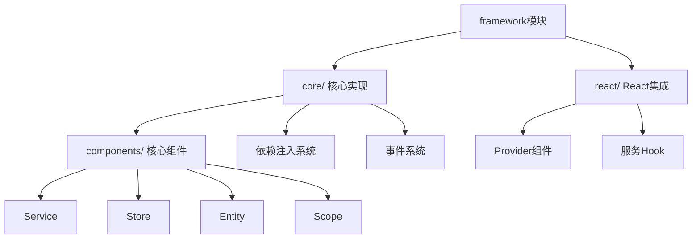
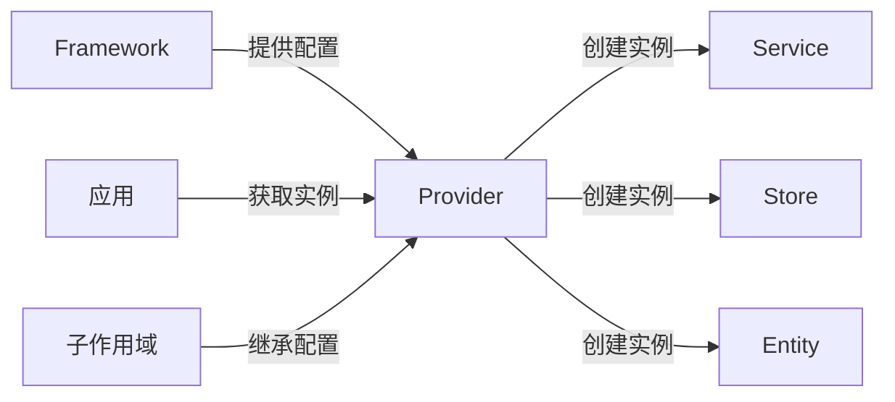
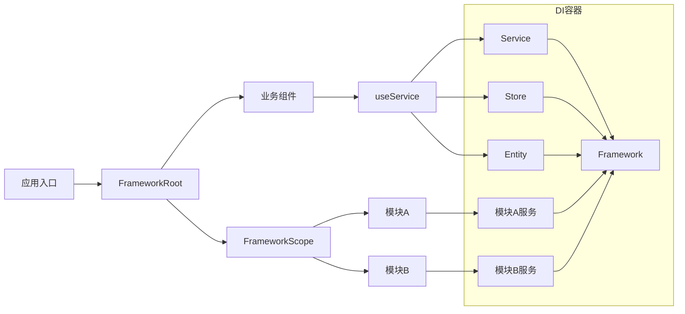

# packages/common/infra/src/framework 模块架构分析

## 整体结构



## 核心目录功能

| 目录/文件           | 功能说明                       |
| ------------------- | ------------------------------ |
| `core/`             | 框架核心实现                   |
| `core/framework.ts` | DI容器中枢，管理组件注册和解析 |
| `core/component.ts` | 所有组件的基类                 |
| `core/provider.ts`  | 依赖注入容器实现               |
| `core/components/`  | 核心组件类型定义               |
| `react/`            | React框架集成层                |
| `__tests__/`        | 单元测试                       |

## 核心组件类型

| 组件类型  | 功能         | 继承关系          |
| --------- | ------------ | ----------------- |
| `Service` | 业务逻辑单元 | 继承自`Component` |
| `Store`   | 状态管理     | 继承自`Component` |
| `Entity`  | 领域模型     | 继承自`Component` |
| `Scope`   | 作用域管理   | 特殊组件类型      |

## 核心类详细分析

### 1. `Framework` 类

**设计意图**：作为DI容器核心，管理组件的注册、解析和生命周期

```typescript
// 初始化示例
const framework = new Framework();

// 注册组件（三种方式）
// 1. 直接注册值
framework.addValue(LoggerService, new ConsoleLogger());

// 2. 注册工厂函数
framework.addFactory(DatabaseService, () => new MySQLDatabase());

// 3. 使用流畅API（推荐）
framework.service(AuthService, [UserRepository]).store(UserStore).entity(UserEntity);
```

### 2. `FrameworkEditor` 类

**设计意图**：提供类型安全的流畅API简化组件注册

```typescript
const editor = new FrameworkEditor(framework);

// 注册服务（自动处理依赖）
editor.service(NotificationService, [LoggerService, EmailService]);

// 注册带依赖的存储
editor.store(UserStore, [UserRepository, LoggerService]);

// 设置作用域
editor.scope(UserScope).service(UserService);

// 覆盖现有实现
editor.override(LoggerService, new CustomLogger());
```

### 3. `Component` 基类

**设计意图**：提供组件的统一生命周期管理

```typescript
class CustomService extends Component {
  constructor() {
    super(); // 自动注入framework和props

    // 注册资源清理回调
    this.disposables.push(() => {
      console.log('Cleaning up resources');
    });
  }

  // 组件生命周期方法
  async initialize() {
    // 初始化逻辑
  }

  dispose() {
    super.dispose(); // 调用父类清理
    // 自定义清理逻辑
  }
}
```

### 4. `Service` 组件

**设计意图**：封装可复用的业务逻辑单元

```typescript
class PaymentService extends Service {
  constructor(
    private paymentGateway: PaymentGatewayService,
    private logger: LoggerService
  ) {
    super();
  }

  processPayment(amount: number) {
    this.logger.log(`Processing $${amount} payment`);
    return this.paymentGateway.charge(amount);
  }
}

// 注册服务
framework.service(PaymentService, [PaymentGatewayService, LoggerService]);
```

### 5. `Store` 组件

**设计意图**：管理应用状态，提供响应式数据绑定

```typescript
class UserStore extends Store {
  @observable users: User[] = [];

  addUser(user: User) {
    this.users.push(user);
    this.emit('user-added', user);
  }

  // 持久化状态
  async save() {
    await localStorage.set('users', this.users);
  }
}

// 注册Store
framework.store(UserStore);
```

### 6. `Entity` 组件

**设计意图**：封装领域模型，处理业务逻辑

```typescript
class UserEntity extends Entity {
  constructor(
    public id: string,
    public name: string,
    public email: string
  ) {
    super();
  }

  // 业务方法
  changeEmail(newEmail: string) {
    this.validateEmail(newEmail);
    this.email = newEmail;
  }

  private validateEmail(email: string) {
    // 验证逻辑
  }
}

// 注册Entity
framework.entity(UserEntity);
```

### 7. 作用域系统

**设计意图**：实现环境隔离和配置覆盖

```typescript
// 定义作用域
const AdminScope = createScope('admin');

// 注册全局服务
framework.service(LoggerService, () => new ConsoleLogger());

// 在admin作用域覆盖实现
framework.scope(AdminScope).override(LoggerService, () => new FileLogger('/var/log/admin.log'));

// 创建作用域provider
const adminProvider = framework.provider([AdminScope]);
```

### 8. `createIdentifier` 函数

**设计意图**：创建类型安全的服务标识符，实现依赖倒置

```typescript
// 定义服务接口
interface Storage {
  get(key: string): string | null;
  set(key: string, value: string): void;
}

// 创建标识符（推荐使用接口名称）
const Storage = createIdentifier<Storage>('Storage');

// 使用变体创建不同实现标识
const LocalStorage = Storage('local');
const SessionStorage = Storage('session');
```

### 9. 标识符关键特性

1. **接口与实现解耦**：

   ```typescript
   // 实现接口
   class LocalStorageImpl implements Storage {
     get(key) {
       return localStorage.getItem(key);
     }
     set(key, value) {
       localStorage.setItem(key, value);
     }
   }

   // 注册实现
   framework.impl(LocalStorage, LocalStorageImpl);
   ```

2. **多实现支持**：

   ```typescript
   // 注册多个实现
   framework.impl(LocalStorage, LocalStorageImpl);
   framework.impl(SessionStorage, SessionStorageImpl);

   // 获取特定实现
   const localStorage = provider.get(LocalStorage);

   // 获取所有实现
   const allStorages = provider.getAll(Storage);
   ```

3. **构造函数标识符生成**：

   ```typescript
   // 自动为类生成唯一标识符
   class AuthService {}
   const authIdentifier = createIdentifierFromConstructor(AuthService);
   ```

4. **标识符解析**：
   ```typescript
   // 解析各种标识符类型
   parseIdentifier(LocalStorage); // => IdentifierValue
   parseIdentifier(AuthService); // => 从类生成标识符
   ```

### 10. 设计优势

1. **类型安全**：在编译时捕获类型错误
2. **灵活性**：支持同一接口的多个实现
3. **可测试性**：轻松替换实现进行测试
4. **可扩展性**：通过变体支持不同环境配置
   **设计意图**：实现环境隔离和配置覆盖

```typescript
// 定义作用域
const AdminScope = createScope('admin');

// 注册全局服务
framework.service(LoggerService, () => new ConsoleLogger());

// 在admin作用域覆盖实现
framework.scope(AdminScope).override(LoggerService, () => new FileLogger('/var/log/admin.log'));

// 创建作用域provider
const adminProvider = framework.provider([AdminScope]);
```

## 框架初始化与配置

在React应用中使用框架前，需要先创建和配置`framework`实例：

```typescript
// 1. 创建框架实例
import { Framework } from '@affine/infra/framework/core';

// 通常会在应用入口文件创建全局框架实例
const framework = new Framework();

// 2. 注册核心服务
framework
  .service(LoggerService, [
    /* 依赖项 */
  ])
  .store(UserStore)
  .entity(ProfileEntity);

// 3. 配置作用域（可选）
const AdminScope = createScope('admin');
framework.scope(AdminScope).override(LoggerService, () => new AdminLogger());
```

在React应用中传递框架实例：

```tsx
// 应用入口文件
import React from 'react';
import { createRoot } from 'react-dom/client';
import { FrameworkRoot } from '@affine/infra/framework/react';
import App from './App';

// 创建框架实例并配置
import { configureFramework } from './framework-config';
const framework = configureFramework();

createRoot(document.getElementById('root')).render(
  <FrameworkRoot framework={framework.provider()}>
    <App />
  </FrameworkRoot>
);
```

#### 配置最佳实践

1. **集中配置**：创建`framework-config.ts`统一管理
2. **模块化配置**：按功能模块拆分
3. **异步初始化**：支持异步加载的服务

## React集成分析

### 核心组件和Hook

`react/index.tsx`文件提供React上下文集成：

```tsx
import { FrameworkRoot, useService } from '@affine/infra/framework/react';

function App() {
  return (
    <FrameworkRoot framework={framework}>
      <ChildComponent />
    </FrameworkRoot>
  );
}

function ChildComponent() {
  const logger = useService(LoggerService);
  logger.log('Rendered');
  return <div>Hello</div>;
}
```

### 作用域隔离实现

**设计意图**：实现功能模块的配置隔离

```tsx
function AdminPanel() {
  return (
    <FrameworkScope scope={AdminScope}>
      <AdminDashboard />
    </FrameworkScope>
  );
}

function AdminDashboard() {
  // 获取的是AdminScope作用域覆盖后的LoggerService
  const logger = useService(LoggerService);

  useEffect(() => {
    logger.log('Admin dashboard mounted');
  }, []);

  return <div>Admin Area</div>;
}
```

## Framework 与 Provider 的关系解析

### 通俗解释

可以将整个系统比作一个**大型工厂**：

- `Framework` 是工厂的 **设计蓝图**（包含所有机器和产品的设计方案）
- `Provider` 是工厂的 **生产车间**（根据蓝图制造具体产品）

### 核心关系



### 详细说明

1. **Framework 是配置中心**

   - 存储所有组件的注册信息（服务、存储、实体等）
   - 定义组件之间的关系和依赖
   - 类似工厂的"设计部门"，只做规划不直接生产

2. **Provider 是实例工厂**

   - 根据Framework的配置创建具体实例
   - 管理实例的生命周期
   - 处理依赖注入（自动解决组件依赖关系）
   - 类似工厂的"生产车间"，负责实际制造

3. **工作流程示例**

```typescript
// 1. 创建蓝图（Framework）
const framework = new Framework();

// 2. 在设计蓝图注册产品设计
framework.service(LoggerService, () => new ConsoleLogger());

// 3. 创建生产车间（Provider）
const provider = framework.provider();

// 4. 车间生产具体产品
const logger = provider.get(LoggerService);
logger.log('产品生产完成！'); // 输出: 产品生产完成！

// 5. 创建子车间（带特殊配置）
const devProvider = framework.provider([DevScope]);
const devLogger = devProvider.get(LoggerService); // 可能是不同的实现
```

### 关键区别

| 特性         | Framework                      | Provider                                 |
| ------------ | ------------------------------ | ---------------------------------------- |
| **角色**     | 配置注册中心                   | 实例工厂                                 |
| **生命周期** | 长期存在（应用级别）           | 可短期存在（作用域级别）                 |
| **状态**     | 无状态（存储配置）             | 有状态（管理实例）                       |
| **创建方式** | 直接实例化 (`new Framework()`) | 从Framework派生 (`framework.provider()`) |

### 实际应用场景

```tsx
// React应用入口
function App() {
  // 创建主车间（通常全局唯一）
  const mainProvider = framework.provider();

  return (
    // 提供车间给所有组件
    <FrameworkContext.Provider value={mainProvider}>
      <Dashboard />
    </FrameworkContext.Provider>
  );
}

// 组件内使用
function UserPanel() {
  // 从上下文获取车间
  const provider = useContext(FrameworkContext);

  // 生产所需服务
  const userService = provider.get(UserService);
  const [user, setUser] = useState(null);

  useEffect(() => {
    userService.getCurrent().then(setUser);
  }, []);

  return <div>{user?.name}</div>;
}
```

## 设计模式与架构思想

### 1. 依赖注入(DI)

- 使用标识符解耦依赖
- 支持构造函数注入
- 分层作用域系统

### 2. 组件生命周期

- 通过`dispose()`管理资源清理
- 自动垃圾回收
- 资源释放回调机制

### 3. 事件系统

- 通过`eventBus`实现组件通信
- 所有组件可通过`this.eventBus`访问
- 松耦合的组件交互

## 完整架构图



## 组件注册与使用详解

### 核心原理：注册 vs 实例化

Framework 采用**两阶段设计**：

1. **注册阶段**：建立 "类型 → 工厂函数" 的映射，不创建实例
2. **实例化阶段**：使用时才根据映射创建实例并解析依赖

```typescript
// 注册阶段：只注册工厂函数，不创建实例
framework
  .service(WorkspacesService, [WorkspaceFlavoursService, ...])  // 注册工厂
  .entity(WorkspaceList, [WorkspaceFlavoursService])            // 注册工厂
  .store(WorkspaceProfileCacheStore, [GlobalCache])            // 注册工厂

// 实例化阶段：使用时才创建实例
const workspacesService = provider.get(WorkspacesService);  // 触发实例创建
const workspace = provider.createEntity(Workspace);        // 创建新实例
```

### 组件注册方式选择

根据**类的继承关系和用途**选择注册方式：

| 注册方法     | 适用类型       | 判断标准           | 使用方式                  |
| ------------ | -------------- | ------------------ | ------------------------- |
| `.service()` | 继承 `Service` | 业务逻辑、单例服务 | `provider.get()`          |
| `.entity()`  | 继承 `Entity`  | 状态对象、多实例   | `provider.createEntity()` |
| `.store()`   | 继承 `Store`   | 数据持久化         | `provider.get()`          |
| `.impl()`    | 实现接口       | 可替换实现         | `provider.get()`          |
| `.scope()`   | 继承 `Scope`   | 作用域管理         | `provider.createScope()`  |

### 各组件类型注册与使用示例

#### 1. Service 注册与使用

```typescript
// 1. 定义 Service 类
export class WorkspacesService extends Service {
  constructor(
    private readonly flavoursService: WorkspaceFlavoursService,
    private readonly listService: WorkspaceListService,
    // ... 其他依赖
  ) {
    super();
  }

  get deleteWorkspace() {
    return this.destroy.deleteWorkspace;
  }
}

// 2. 注册 Service（声明依赖关系）
framework.service(WorkspacesService, [
  WorkspaceFlavoursService,    // 依赖1
  WorkspaceListService,        // 依赖2
  // ... 其他依赖
])

// 3. 在 React 组件中使用
function Component() {
  const workspacesService = useService(WorkspacesService);  // 获取单例
  const handleDelete = () => workspacesService.deleteWorkspace(id);
  return <button onClick={handleDelete}>删除</button>;
}
```

#### 2. Entity 注册与使用

```typescript
// 1. 定义 Entity 类
export class WorkspaceList extends Entity {
  workspaces$ = LiveData.from<WorkspaceMetadata[]>(/* ... */);

  constructor(private readonly flavoursService: WorkspaceFlavoursService) {
    super();
  }

  revalidate() {
    this.flavoursService.flavours$.value.forEach(provider => {
      provider.revalidate?.();
    });
  }
}

// 2. 注册 Entity（声明依赖关系）
framework.entity(WorkspaceList, [WorkspaceFlavoursService])

// 3. 在 Service 中动态创建实例
export class WorkspaceListService extends Service {
  // 每次调用都创建新实例（noCache: true）
  list = this.framework.createEntity(WorkspaceList);
}

export class WorkspaceProfileService extends Service {
  getProfile = (metadata: WorkspaceMetadata): WorkspaceProfile => {
    // 为每个工作区创建独立的Profile实例
    const profile = this.framework.createEntity(WorkspaceProfile, { metadata });
    return this.pool.put(metadata.id, profile).obj;
  };
}

// 4. 在 React 组件中通过 Service 使用
function Component() {
  const workspaceListService = useService(WorkspaceListService);
  const workspaces = useLiveData(workspaceListService.list.workspaces$);
  return <div>{workspaces.length} workspaces</div>;
}
```

#### 3. Store 注册与使用

```typescript
// 1. 定义 Store 类
export class WorkspaceProfileCacheStore extends Store {
  constructor(private readonly cache: GlobalCache) {
    super();
  }

  watchProfileCache(workspaceId: string) {
    return this.cache.watch(WORKSPACE_PROFILE_CACHE_KEY + workspaceId);
  }

  setProfileCache(workspaceId: string, info: WorkspaceProfileInfo) {
    this.cache.set(WORKSPACE_PROFILE_CACHE_KEY + workspaceId, info);
  }
}

// 2. 注册 Store
framework.store(WorkspaceProfileCacheStore, [GlobalCache]);

// 3. 在 Entity 中依赖注入使用
export class WorkspaceProfile extends Entity {
  constructor(
    private readonly store: WorkspaceProfileCacheStore, // 自动注入
    private readonly flavoursService: WorkspaceFlavoursService
  ) {
    super();
  }

  syncWithWorkspace(workspace: Workspace) {
    this.store.setProfileCache(workspace.id, this.profileInfo);
  }
}

// 4. 注册 Entity（声明 Store 依赖）
framework.entity(WorkspaceProfile, [
  WorkspaceProfileCacheStore, // Store 依赖
  WorkspaceFlavoursService, // Service 依赖
]);
```

#### 4. Impl 注册与使用（接口实现）

```typescript
// 1. 定义接口和标识符
export interface WorkspaceLocalState extends Memento {}
export const WorkspaceLocalState = createIdentifier<WorkspaceLocalState>('WorkspaceLocalState');

// 2. 定义实现类
export class WorkspaceLocalStateImpl implements WorkspaceLocalState {
  constructor(workspaceService: WorkspaceService, globalState: GlobalState) {
    this.wrapped = wrapMemento(globalState, `workspace-state:${workspaceService.workspace.id}:`);
  }

  get<T>(key: string): T | undefined {
    return this.wrapped.get<T>(key);
  }

  set<T>(key: string, value: T): void {
    return this.wrapped.set<T>(key, value);
  }
}

// 3. 注册接口实现
framework.impl(WorkspaceLocalState, WorkspaceLocalStateImpl, [
  WorkspaceService, // 实现类的依赖
  GlobalState, // 实现类的依赖
]);

// 4. 在 Service 中注入接口使用
export class RecentDocsService extends Service {
  constructor(
    private readonly localState: WorkspaceLocalState, // 注入接口，框架自动提供实现
    private readonly docsService: DocsService
  ) {
    super();
  }

  addRecentDoc(pageId: string) {
    this.localState.set(RECENT_PAGES_KEY, recentPages); // 使用接口方法
  }
}
```

#### 5. Scope 注册与使用

```typescript
// 1. 定义 Scope 类
export class WorkspaceScope extends Scope<WorkspaceOpenOptions> {
  override dispose(): void {
    // 清理工作区相关资源
  }
}

// 2. 注册 Scope
framework.scope(WorkspaceScope);

// 3. 在 Service 中创建作用域
export class WorkspaceRepositoryService extends Service {
  instantiate(openOptions: WorkspaceOpenOptions) {
    // 为每个工作区创建独立的依赖注入容器
    const workspaceScope = this.framework.createScope(WorkspaceScope, {
      openOptions,
      engineWorkerInitOptions,
    });

    // 在工作区作用域内获取服务
    const workspace = workspaceScope.get(WorkspaceService).workspace;
    return workspace;
  }
}
```

### 关键设计原理

#### 1. 为什么必须先注册？

```typescript
// createEntity() 内部调用流程
createEntity(identifier) {
  return this.getRaw(identifier, { noCache: true });  // 查找已注册的工厂函数
}

getRaw(identifier) {
  const factory = this.collection.getFactory(identifier);  // 查找工厂函数
  if (!factory) {
    throw new ComponentNotFoundError(identifier);  // 如果没注册，抛出异常
  }
  return factory(this);  // 执行工厂函数创建实例
}
```

#### 2. 注册建立的映射关系

```typescript
// 框架内部类似这样的映射表
{
  "WorkspaceList": (provider) => new WorkspaceList(
    provider.get(WorkspaceFlavoursService),  // 自动解析依赖
    provider
  ),
  "WorkspaceLocalState": (provider) => new WorkspaceLocalStateImpl(
    provider.get(WorkspaceService),
    provider.get(GlobalState)
  ),
}
```

#### 3. 生命周期差异

```typescript
// Service: 单例，依赖注入
const service = provider.get(WorkspaceService); // 缓存的单例

// Entity: 多实例，动态创建
const entity1 = provider.createEntity(WorkspaceList); // 新实例
const entity2 = provider.createEntity(WorkspaceList); // 另一个新实例

// Store: 单例，持久化
const store = provider.get(WorkspaceProfileCacheStore); // 缓存的单例

// Impl: 单例，接口实现
const impl = provider.get(WorkspaceLocalState); // 缓存的实现实例
```

#### 4. 依赖注入 vs 动态创建的选择

**构造函数依赖注入** - 用于单例组件：

```typescript
class WorkspacesService extends Service {
  constructor(
    private readonly flavoursService: WorkspaceFlavoursService, // 单例注入
    private readonly listService: WorkspaceListService // 单例注入
  ) {
    super();
  }
}
```

**动态创建** - 用于多实例组件：

```typescript
class WorkspaceListService extends Service {
  list = this.framework.createEntity(WorkspaceList); // 动态创建新实例
}

class WorkspaceProfileService extends Service {
  getProfile(metadata: WorkspaceMetadata) {
    // 为每个工作区创建独立实例
    return this.framework.createEntity(WorkspaceProfile, { metadata });
  }
}
```

### 完整注册配置示例

```typescript
export function configureWorkspaceModule(framework: Framework) {
  framework
    // 注册基础服务（被其他组件依赖）
    .service(WorkspaceFlavoursService, [[WorkspaceFlavoursProvider]])
    .service(WorkspaceListService)
    .service(WorkspaceProfileService)

    // 注册 Entity（多实例，状态对象）
    .entity(WorkspaceList, [WorkspaceFlavoursService])
    .entity(WorkspaceProfile, [WorkspaceProfileCacheStore, WorkspaceFlavoursService])

    // 注册 Store（持久化）
    .store(WorkspaceProfileCacheStore, [GlobalCache])

    // 注册接口实现（可替换）
    .impl(WorkspaceLocalState, WorkspaceLocalStateImpl, [WorkspaceService, GlobalState])
    .impl(WorkspaceLocalCache, WorkspaceLocalCacheImpl, [WorkspaceService, GlobalCache])

    // 注册作用域
    .scope(WorkspaceScope)

    // 注册作用域内的服务
    .service(WorkspaceService) // 在 WorkspaceScope 内使用
    .entity(Workspace, [WorkspaceScope, FeatureFlagService])

    // 注册复合服务（依赖多个子服务）
    .service(WorkspacesService, [
      WorkspaceFlavoursService,
      WorkspaceListService,
      WorkspaceProfileService,
      // ... 其他依赖
    ]);
}
```

### 使用示例集合

#### 基础使用

```typescript
// 服务定义
class LoggerService extends Service {
  log(message: string) {
    console.log(message);
  }
}

// 框架初始化
const framework = new Framework();
framework.service(LoggerService);

// 获取服务实例
const logger = framework.provider().get(LoggerService);
logger.log('Hello Framework!');
```

#### 作用域使用

```typescript
// 用户作用域
const UserScope = createScope('user');

// 在用户作用域注册服务
framework.scope(UserScope).service(UserService, [UserRepository]);

// 创建用户作用域provider
const userProvider = framework.provider([UserScope]);
const userService = userProvider.get(UserService);
```

#### React集成

```tsx
import { FrameworkRoot, useServices } from '@affine/infra/framework/react';

function ShoppingCart() {
  const { cartService, paymentService } = useServices({
    CartService,
    PaymentService,
  });

  const checkout = () => {
    paymentService.processPayment(cartService.total);
  };

  return (
    <div>
      <button onClick={checkout}>Checkout</button>
    </div>
  );
}
```
