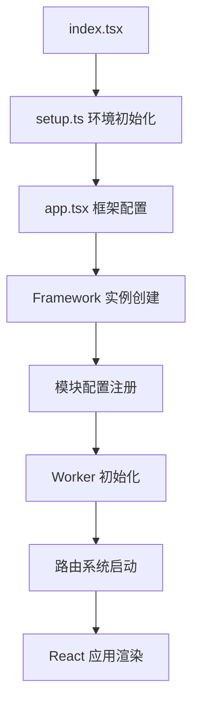
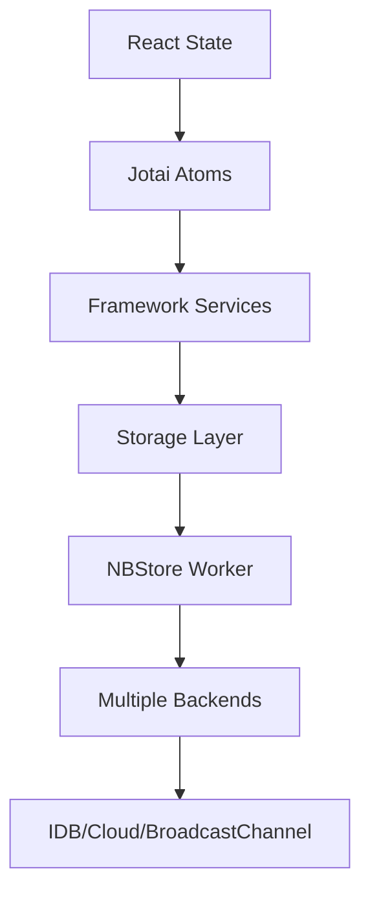

# AFFiNE Web 模块学习指南

欢迎来到 AFFiNE Web 模块的学习之旅！本文档旨在帮助初学者理解 `packages/frontend/apps/web` 模块的核心技术、架构和开发流程。我们将用简单易懂的语言，带你一步步探索这个模块的奥秘。

## 1. Web 模块是什么？

`packages/frontend/apps/web` 是 AFFiNE 桌面版 Web 应用的“大脑”和“入口”。你可以把它想象成一个总指挥部，它不直接处理具体的业务（比如写文档、画图），而是负责把 AFFiNE 的各个功能模块（比如核心逻辑、UI 组件、基础设施）整合起来，形成一个完整的、用户可以直接使用的应用程序。

### 1.1 它的定位和特点

- **应用类型**: 这是一个桌面版的 Web 应用，意味着它主要在浏览器中运行，也可以通过 Electron 框架打包成桌面应用。
- **技术基础**: 它基于目前非常流行的 React 19 和 TypeScript 技术构建，这让代码更稳定、更容易维护。
- **运行平台**: 既能在普通浏览器里跑，也能在 Electron 桌面应用里跑。
- **版本**: 当前版本是 0.21.0。

### 1.2 核心亮点

- **技术新潮**: 使用了 React 19、TypeScript 5.7 和 Emotion (一种写 CSS 的方式)，都是很现代的技术。
- **模块化设计**: 采用了 `@toeverything/infra` 框架的“依赖注入”系统，这让各个模块之间联系更松散，更容易独立开发和测试。
- **灵活的状态管理**: 结合了 Jotai（一个轻量级状态管理库）、自定义存储和 React 自身的状态管理，能很好地管理应用中的各种数据。
- **美观的主题系统**: 支持深色/浅色模式切换，你甚至可以自定义主题。
- **响应式设计**: 无论你在电脑、平板还是手机上使用，界面都能很好地适应。
- **性能卓越**: 通过代码分割、懒加载和 Worker 多线程技术，让应用运行更流畅。

## 2. Web 模块的“骨架”：目录结构和核心文件

Web 模块本身非常“苗条”，只包含几个核心文件。它就像一个启动器，大部分的“肌肉”（页面组件和业务逻辑）都放在了 `@affine/core` 模块里。

### 2.1 目录结构

```
packages/frontend/apps/web/
├── src/                    # 源码目录（只有4个核心文件）
│   ├── app.tsx            # 应用主组件，负责框架初始化和配置
│   ├── index.tsx          # 应用的真正入口，负责把应用挂载到网页上
│   ├── setup.ts           # 环境初始化，比如主题设置、浏览器兼容性处理
│   └── nbstore.worker.ts  # 存储 Worker，在后台处理数据存储和同步
├── package.json          # 项目的配置信息，比如依赖库、脚本命令
├── tsconfig.json         # TypeScript 的配置，告诉 TypeScript 如何编译代码
└── README.md             # 项目的简要说明
```

### 2.2 核心文件功能详解

#### `src/index.tsx` - 应用的“大门”

这是整个应用的起点。它负责把 React 应用“挂载”到网页上，让用户能看到和操作界面。

```typescript
// 应用挂载逻辑
function mountApp() {
  const root = document.getElementById('app')!; // 找到网页中 id 为 'app' 的元素
  createRoot(root).render( // 把 React 应用渲染到这个元素里
    <StrictMode> // 严格模式，帮助发现潜在问题
      <Telemetry />  // 遥测组件，用于收集应用使用数据
      <App />        // 我们的主应用组件
    </StrictMode>
  );
}
```

#### `src/app.tsx` - 应用的“心脏”

这个文件是应用的主组件，它负责：

- **框架初始化和依赖注入**: 启动 `@toeverything/infra` 框架，并配置好各种服务。
- **多 Worker 支持**: 处理 SharedWorker（多标签页共享）和普通 Worker（单标签页）的逻辑，让数据处理能在后台进行，不卡顿界面。
- **路由系统集成**: 把应用的导航功能连接起来。
- **全局上下文提供**: 提供一些全局可用的数据和功能。

#### `src/setup.ts` - 应用的“准备工作”

这个文件在应用启动前做一些准备工作，比如：

- **浏览器环境引导**: 确保应用在不同浏览器中都能正常运行。
- **清理任务配置**: 设置一些在应用关闭时需要执行的清理操作。
- **主题系统初始化**: 设置应用的默认主题（深色或浅色）。

#### `src/nbstore.worker.ts` - 应用的“数据管家”

这是一个在后台运行的 Worker 线程，专门负责数据存储和处理，它能：

- **集成多种存储后端**: 支持 IndexedDB（浏览器本地数据库）、BroadcastChannel（跨标签页通信）和 Cloud（云端存储）。
- **后台数据处理**: 在不影响主界面的情况下处理大量数据。
- **跨标签页数据同步**: 确保你在不同标签页打开 AFFiNE 时，数据是同步的。

## 3. Web 模块的“工具箱”：技术栈与依赖关系

Web 模块使用了许多优秀的工具和库来构建。

### 3.1 核心技术栈一览

| 技术         | 版本    | 用途                                 |
| :----------- | :------ | :----------------------------------- |
| React        | 19.0.0  | 构建用户界面的核心库                 |
| TypeScript   | 5.7.2   | 为 JavaScript 添加类型，提高代码质量 |
| React Router | 6.28.0  | 管理应用内部的页面跳转和导航         |
| Emotion      | 11.14.0 | 一种在 JavaScript 中写 CSS 的方式    |
| Sentry       | 9.2.0   | 监控应用错误和性能                   |

### 3.2 内部依赖模块

Web 模块依赖于 AFFiNE 项目内部的其他模块，它们共同构成了 AFFiNE 的完整功能：

- `@affine/component`: AFFiNE 的 UI 组件库，提供了各种按钮、输入框等界面元素。
- `@affine/core`: AFFiNE 的核心业务逻辑模块，包含了大部分的页面和功能实现。
- `@affine/env`: 环境配置模块，用于区分开发、生产等不同环境。
- `@affine/i18n`: 国际化模块，支持多语言。
- `@affine/nbstore`: 存储系统模块，处理数据的持久化。
- `@affine/track`: 用户行为追踪模块。
- `@toeverything/infra`: AFFiNE 的基础设施框架，提供了依赖注入等核心能力。

### 3.3 构建工具链

为了把代码变成可运行的应用，我们使用了一系列工具：

- **构建工具**: 主要使用自定义的 Webpack 配置（通过 `affine bundle` 命令）。
- **开发服务器**: Webpack Dev Server，让你在开发时能实时看到代码修改的效果。
- **代码检查**: ESLint 和 Prettier，帮助我们保持代码风格一致，减少错误。
- **类型检查**: TypeScript Compiler，检查代码中的类型错误。
- **测试框架**: Vitest 和 Playwright，用于编写和运行各种测试，确保代码质量。

## 4. 应用如何启动和运行？

了解应用的启动流程，能帮助你更好地理解各个部分是如何协同工作的。

### 4.1 启动流程图



### 4.2 框架初始化过程

在 `app.tsx` 中，应用会进行一系列的初始化操作：

1.  **创建应用框架实例**: 就像搭建一个骨架，`new Framework()` 创建了整个应用的基础结构。
2.  **配置核心模块**: 把 AFFiNE 的通用模块、浏览器工作台模块、本地存储模块、工作区类型等都配置好，让它们能正常工作。
3.  **注册服务提供者**: 注册一些重要的服务，比如 `NbstoreProvider`（存储服务）和 `PopupWindowProvider`（弹出窗口服务）。
4.  **启动应用生命周期**: 告诉框架“应用已经准备好启动了！”

```typescript
// 1. 创建应用框架实例
const framework = new Framework();

// 2. 配置核心模块
configureCommonModules(framework); // 通用模块，比如国际化、工作区管理
configureBrowserWorkbenchModule(framework); // 浏览器工作台相关配置
configureLocalStorageStateStorageImpls(framework); // 本地存储的实现
configureBrowserWorkspaceFlavours(framework); // 工作区类型（本地/云端）

// 3. 注册服务提供者
framework.impl(NbstoreProvider, { openStore }); // 注册存储服务
framework.impl(PopupWindowProvider, { open }); // 注册弹出窗口服务

// 4. 启动应用生命周期
frameworkProvider.get(LifecycleService).applicationStart();
```

### 4.3 Worker 多线程架构

为了让应用更流畅，AFFiNE 使用了 Web Worker 技术，让一些耗时的操作在后台线程中运行，不阻塞主界面。

- **SharedWorker 优先**: 如果浏览器支持 SharedWorker，并且没有禁用它，应用会优先使用 SharedWorker。SharedWorker 的好处是，如果你打开了多个 AFFiNE 标签页，它们可以共享同一个 Worker，这样可以节省资源，并方便数据同步。
- **普通 Worker 回退**: 如果不支持 SharedWorker，或者被禁用了，应用会回退到使用普通的 Worker。普通 Worker 是每个标签页独立的。

```typescript
// SharedWorker 优先策略
if (window.SharedWorker && localStorage.getItem('disableSharedWorker') !== 'true') {
  // 多标签页共享 Worker
  const worker = new SharedWorker(workerUrl, {
    name: 'affine-shared-worker',
  });
  storeManagerClient = new StoreManagerClient(new OpClient(worker.port));
} else {
  // 回退到普通 Worker
  const worker = new Worker(workerUrl);
  storeManagerClient = new StoreManagerClient(new OpClient(worker));
}
```

## 5. 页面跳转和导航：路由系统

路由系统负责管理应用中的页面跳转和导航。

### 5.1 路由配置架构

**重要提示**: Web 模块本身不包含具体的页面组件，所有的页面组件和路由配置都定义在 `@affine/core/desktop/router.tsx` 中。Web 模块只是导入并使用了这些配置。

```typescript
// 在 app.tsx 中导入 core 模块的路由
import { router } from '@affine/core/desktop/router';

// 路由配置实际在 core 模块中定义
export const topLevelRoutes = [
  {
    element: <RootRouter />, // 根路由组件
    errorElement: <AffineErrorComponent />, // 错误页面组件
    children: [
      { path: '/', lazy: () => import('./pages/index') }, // 首页/工作区列表
      { path: '/workspace/:workspaceId/*', lazy: () => import('./pages/workspace/index') }, // 工作区主界面
      { path: '/auth/:authType', lazy: () => import('./pages/auth/auth') }, // 用户认证页面
      // ... 更多路由
    ],
  },
];
```

### 5.2 主要页面结构（位于 `@affine/core` 模块）

| 路由路径           | 组件位置                       | 功能描述        |
| :----------------- | :----------------------------- | :-------------- |
| `/`                | `core/desktop/pages/index`     | 首页/工作区列表 |
| `/workspace/:id/*` | `core/desktop/pages/workspace` | 工作区主界面    |
| `/auth/:type`      | `core/desktop/pages/auth`      | 用户认证        |
| `/invite/:id`      | `core/desktop/pages/invite`    | 邀请页面        |
| `/404`             | `core/desktop/pages/404`       | 错误页面        |

### 5.3 懒加载机制

为了提高应用的加载速度，AFFiNE 使用了懒加载（Lazy Loading）技术。这意味着只有当用户访问某个页面时，相关的代码才会被加载，而不是一次性加载所有代码。

```typescript
// 在 @affine/core/desktop/router.tsx 中定义
{
  path: '/auth/:authType',
  lazy: () => import(/* webpackChunkName: "auth" */ './pages/auth/auth'), // 使用 webpackChunkName 来给代码块命名
}
```

### 5.4 Web 模块在路由系统中的职责

Web 模块在路由系统中扮演的角色是：

1.  **路由提供者**: 通过 `<RouterProvider router={router} />` 组件，把路由功能提供给整个应用。
2.  **配置导入**: 导入并使用 `@affine/core` 模块中定义好的路由配置。
3.  **错误处理**: 提供路由级别的错误边界，当路由出现问题时能显示友好的错误页面。
4.  **未来特性**: 配置 React Router v7 的一些新特性。

## 6. 数据管理：状态管理架构

AFFiNE Web 应用采用了多层状态管理架构，就像一个分工明确的团队，每一层都有自己的职责。

### 6.1 多层状态管理设计



#### 状态层级说明

1.  **React State**: 这是最基础的状态，通常用于管理组件内部的局部数据，比如一个输入框的值、一个按钮是否被点击。
2.  **Jotai Atoms**: Jotai 是一个轻量级的状态管理库，它把应用的状态拆分成一个个独立的“原子”（Atom）。这些原子可以被组件订阅，当原子状态变化时，只有订阅它的组件才会重新渲染，实现细粒度的更新。
3.  **Framework Services**: 这是业务逻辑层，通过依赖注入系统管理。比如，一个用户服务可能负责处理用户登录、注册等逻辑，它会操作 Jotai Atoms 或 Storage Layer 来更新数据。
4.  **Storage Layer**: 这是一个统一的存储抽象层，它提供了一套接口，让上层业务逻辑不需要关心数据具体存储在哪里（是本地数据库还是云端）。
5.  **NBStore Worker**: 这是一个后台 Worker 线程，专门负责处理数据存储和同步的复杂逻辑，避免阻塞主线程。
6.  **Multiple Backends**: NBStore Worker 支持多种存储后端，这意味着数据可以存储在不同的地方。
7.  **IDB/Cloud/BroadcastChannel**: 具体的数据存储方式，包括 IndexedDB（浏览器本地数据库）、Cloud（云端存储）和 BroadcastChannel（用于跨标签页通信和数据同步）。

### 6.2 核心状态管理组件

#### AffineContext - 全局上下文

这个组件提供了全局的 Jotai Store 实例，让整个应用都能访问和修改全局状态。

```typescript
<AffineContext store={getCurrentStore()}>
  {/* 提供全局 Jotai Store 实例 */}
  <RouterProvider router={router} />
</AffineContext>
```

#### FrameworkRoot - 依赖注入的“根”

这个组件提供了服务依赖注入的容器，让各个服务能够方便地获取它们所需的依赖。

```typescript
<FrameworkRoot framework={frameworkProvider}>
  {/* 提供服务依赖注入容器 */}
  <CacheProvider value={cache}> {/* Emotion 样式缓存 */}
    <I18nProvider> {/* 国际化提供者 */}
      {/* 应用组件树 */}
    </I18nProvider>
  </CacheProvider>
</FrameworkRoot>
```

### 6.3 存储系统集成

#### NBStore Worker 配置

NBStore Worker 负责处理数据的存储和同步，它集成了多种存储方式：

```typescript
const consumer = new StoreManagerConsumer([
  ...idbStorages, // IndexedDB 存储，用于本地持久化数据
  ...idbV1Storages, // 兼容旧版本的 IndexedDB 存储
  ...broadcastChannelStorages, // 跨标签页同步数据
  ...cloudStorages, // 云端存储
]);
```

#### 存储提供者注册

在框架初始化时，会注册 `NbstoreProvider`，这样其他模块就可以通过这个提供者来访问存储服务。

```typescript
framework.impl(NbstoreProvider, {
  openStore(key, options) {
    return storeManagerClient.open(key, options);
  },
});
```

## 7. 应用的“外观”：样式系统与主题

AFFiNE 的界面美观且支持主题切换，这得益于其灵活的样式系统。

### 7.1 CSS-in-JS 方案

AFFiNE 使用了 Emotion 和 Vanilla Extract 这两种 CSS-in-JS 方案。

#### Emotion 配置

Emotion 允许你在 JavaScript 中编写 CSS，并将其注入到页面中。

```typescript
// 创建样式缓存实例，支持样式隔离
const cache = createEmotionCache();

// 在应用根节点提供缓存
<CacheProvider value={cache}>
  {/* 应用组件 */}
</CacheProvider>
```

#### Vanilla Extract 集成

Vanilla Extract 是一种“零运行时”的 CSS-in-JS 解决方案，它在构建时将样式提取为独立的 CSS 文件，而不是在运行时生成。

- **零运行时**: 样式在构建时生成，运行时没有额外的开销。
- **类型安全的样式定义**: 可以在 TypeScript 中定义样式，享受类型检查的好处。
- **构建时样式提取和优化**: 生成的 CSS 文件更小，加载更快。

### 7.2 主题系统设计

AFFiNE 支持深色和浅色主题。

#### 主题提供者架构

`ThemeObserver` 组件会监听当前主题的变化，并通知 `AppThemeService` 更新应用的主题。

```typescript
// 主题观察者组件
function ThemeObserver() {
  const { resolvedTheme } = useTheme(); // 获取当前解析出的主题
  const service = useService(AppThemeService); // 获取主题服务

  useEffect(() => {
    service.appTheme.theme$.next(resolvedTheme); // 当主题变化时，通知主题服务
  }, [resolvedTheme, service.appTheme.theme$]);

  return null; // 这个组件不渲染任何 UI
}
```

#### 支持的主题类型

目前支持 `dark`（深色）和 `light`（浅色）两种主题。

```typescript
const themes = ['dark', 'light'];
```

### 7.3 响应式设计

AFFiNE 的界面能够适应不同的屏幕尺寸和平台（Web/Electron/Mobile）。

#### 平台适配策略

根据构建配置（是 Electron 桌面应用还是浏览器应用），选择不同的布局组件。

```typescript
// 根据构建配置选择布局组件
const LayoutComponent = BUILD_CONFIG.isElectron ? DesktopLayout : BrowserLayout;
```

#### 移动端适配

针对移动设备，特别是 iOS，会考虑安全区域（如刘海屏、底部手势区）的适配。

```css
/* 移动端安全区域适配 */
:root {
  --app-tab-height: BUILD_CONFIG.isIOS ? '49px': '62px'; /* 根据 iOS 调整 Tab 高度 */
  --app-tab-safe-area: calc(var(--app-tab-height) + env(safe-area-inset-bottom)); /* 加上底部安全区域 */
}
```

## 8. 构建和优化：让应用跑得更快

为了让 AFFiNE 应用在不同环境下都能高效运行，我们有一套完善的构建配置和优化策略。

### 8.1 Webpack 配置分析

Webpack 是一个强大的模块打包工具，它负责把我们的代码打包成浏览器可以理解的文件。

#### 基础配置

```javascript
const config = {
  target: ['web', 'es2022'], // 构建目标是 Web 平台，使用 ES2022 语法
  mode: buildConfig.debug ? 'development' : 'production', // 根据是否是调试模式选择开发或生产环境
  devtool: buildConfig.debug ? 'cheap-module-source-map' : 'source-map', // 调试工具，方便定位代码问题
  experiments: {
    topLevelAwait: true, // 允许在模块顶层使用 await
    outputModule: false, // 不输出 ES 模块
    syncWebAssembly: true, // 支持同步加载 WebAssembly
  },
};
```

#### 输出配置

Webpack 会把打包好的文件输出到 `dist` 目录，并根据配置给文件名加上哈希值，方便缓存。

```javascript
output: {
  filename: buildConfig.debug // 调试模式下文件名简单，生产模式下带哈希值
    ? 'js/[name].js'
    : 'js/[name].[contenthash:8].js',
  assetModuleFilename: buildConfig.debug // 静态资源文件名也带哈希值
    ? '[name].[contenthash:8][ext]'
    : 'assets/[name].[contenthash:8][ext][query]',
  publicPath: '/', // 公共路径，用于加载资源
}
```

### 8.2 性能优化策略

#### 代码分割配置

代码分割（Code Splitting）是一种优化技术，它把代码分成小块，只在需要时才加载，从而减少初始加载时间。

```javascript
splitChunks: {
  maxInitialRequests: Infinity, // 初始请求的最大数量
  chunks: 'all', // 对所有类型的代码块进行分割
  cacheGroups: {
    defaultVendors: { // 默认的第三方库分组
      test: /[\\/]node_modules[\\/](?!.*vanilla-extract)/, // 匹配 node_modules 中的文件，排除 vanilla-extract
      priority: -10, // 优先级
      reuseExistingChunk: true, // 尽可能复用已有的代码块
    },
    styles: { // 样式文件分组
      name: 'styles',
      type: 'css/mini-extract', // 提取 CSS 到单独文件
      chunks: 'all',
      enforce: true,
    },
  },
}
```

#### Worker 优化

Worker 线程有专门的构建配置，确保它们能独立运行。

```javascript
// Worker 专用构建配置
{
  target: ['webworker', 'es2022'], // 构建目标是 Web Worker
  output: {
    filename: `js/${workerName}-${buildConfig.appVersion}.worker.js`, // Worker 文件名
    globalObject: 'globalThis', // Worker 中的全局对象
  },
}
```

### 8.3 构建产物说明

Web 模块构建完成后，会在 `dist` 目录生成以下文件：

#### 主要文件类型

- **JavaScript**: 包含主应用代码和 Worker 线程的代码。
- **CSS**: 在生产环境下，CSS 会被提取成单独的文件。
- **Assets**: 图片、字体等静态资源，它们会从 `@affine/core/public` 目录复制过来。
- **HTML**: 应用的入口模板文件。

#### 缓存策略

- **内容哈希命名**: 文件名中包含内容的哈希值（`[name].[contenthash:8].js`），如果文件内容不变，哈希值就不会变，浏览器就可以长期缓存。
- **长期缓存**: 静态资源也会进行版本控制，方便长期缓存。
- **增量更新**: 只有发生变化的文件才会被更新，提高部署效率。

**注意**: `dist` 目录是构建后的产物，不属于源码架构分析的范围。

## 9. 开发和调试：让开发更顺畅

为了方便开发者，AFFiNE 提供了一套完善的开发工具和调试方法。

### 9.1 开发环境配置

#### 开发命令

- **开发模式启动**: 运行 `yarn dev` 命令，它等价于 `affine bundle --dev`。这会启动一个开发服务器，并开启热重载，让你在修改代码后能立即看到效果。
- **生产构建**: 运行 `yarn build` 命令，它等价于 `affine bundle`。这会生成用于生产环境的优化过的代码。

```bash
# 开发模式启动
yarn dev
# 等价于: affine bundle --dev

# 生产构建
yarn build
# 等价于: affine bundle
```

#### TypeScript 配置

`tsconfig.json` 文件告诉 TypeScript 编译器如何处理我们的代码。

```json
{
  "extends": "../../../../tsconfig.web.json", // 继承基础的 Web TypeScript 配置
  "compilerOptions": {
    "rootDir": "./src", // 源码目录
    "outDir": "./dist", // 输出目录
    "tsBuildInfoFile": "./dist/tsconfig.tsbuildinfo" // TypeScript 构建信息文件
  },
  "references": [
    // 引用其他项目，方便类型检查和跳转
    { "path": "../../component" },
    { "path": "../../core" },
    { "path": "../../../common/env" }
    // ... 更多项目引用
  ]
}
```

### 9.2 调试工具集成

#### Sentry 错误监控

Sentry 用于在生产环境中监控应用错误和性能问题。

```typescript
// 生产环境错误追踪
const createBrowserRouter = window.SENTRY_RELEASE ? wrapCreateBrowserRouterV6(reactRouterCreateBrowserRouter) : reactRouterCreateBrowserRouter;
```

#### 开发者工具

- **React DevTools**: 浏览器扩展，用于检查 React 组件树、组件状态和属性。
- **Redux DevTools**: 浏览器扩展，通过 Jotai 集成，用于调试应用的状态变化。
- **Webpack Bundle Analyzer**: 一个工具，可以可视化地分析 Webpack 打包后的文件大小，帮助你找出哪些文件过大，从而进行优化。
- **Source Maps**: 源码映射，在浏览器调试时，即使代码被压缩或打包，也能看到原始的源代码，方便定位问题。

### 9.3 测试配置

为了确保代码质量，AFFiNE 编写了各种测试。

#### Vitest 配置

Vitest 是一个快速的单元测试框架。

```typescript
export default defineConfig({
  plugins: [vanillaExtractPlugin(), swc.vite()], // 插件配置
  test: {
    browser: {
      // 浏览器测试配置
      enabled: true,
      name: 'chromium', // 使用 Chromium 浏览器
      provider: 'playwright', // 使用 Playwright 作为测试提供者
    },
    coverage: {
      // 代码覆盖率配置
      provider: 'istanbul',
      reporter: ['lcov'], // 输出 lcov 格式的覆盖率报告
    },
  },
});
```

#### 测试策略

- **单元测试**: 针对单个函数或组件进行测试，确保它们按预期工作。
- **集成测试**: 测试不同模块之间的交互，确保它们能协同工作。
- **端到端测试**: 模拟用户操作，测试整个应用的用户流程（使用 Playwright）。

## 10. 编码规范和开发建议

为了保持代码质量和团队协作效率，我们遵循一些编码规范和最佳实践。

### 10.1 编码规范

#### 命名约定

- **组件命名**: 使用 `PascalCase`（大驼峰命名法），例如 `UserProfile`。
- **变量/函数命名**: 使用 `camelCase`（小驼峰命名法），例如 `getUserData`。
- **常量命名**: 使用 `UPPER_SNAKE_CASE`（全大写下划线命名法），例如 `API_BASE_URL`。
- **类型命名**: 使用 `PascalCase`，例如 `UserData`。

```typescript
// 组件命名：PascalCase
export const UserProfile = () => {
  /* ... */
};

// 变量/函数命名：camelCase
const getUserData = async () => {
  /* ... */
};

// 常量命名：UPPER_SNAKE_CASE
const API_BASE_URL = 'https://api.example.com';

// 类型命名：PascalCase
interface UserData {
  id: string;
  name: string;
}
```

#### 导入排序

为了保持代码整洁，我们对导入语句进行了排序：

1.  **外部库**: 例如 `react`、`react-router-dom`。
2.  **内部模块**: 例如 `@affine/component`、`@toeverything/infra`，按字母顺序排列。
3.  **相对导入**: 例如 `./styles.css`。

```typescript
// 1. 外部库
import React from 'react';
import { useNavigate } from 'react-router-dom';

// 2. 内部模块（按字母顺序）
import { Button } from '@affine/component';
import { useService } from '@toeverything/infra';

// 3. 相对导入
import './styles.css';
```

### 10.2 组件开发模式

#### 函数组件模式

我们主要使用 React 函数组件来构建 UI。

```typescript
interface Props {
  title: string;
  onAction?: () => void;
}

export const MyComponent: React.FC<Props> = ({ title, onAction }) => {
  const [state, setState] = useState(false); // 使用 useState 管理组件内部状态

  return (
    <div>
      <h1>{title}</h1>
      <button onClick={onAction}>Action</button>
    </div>
  );
};
```

#### 服务集成模式

组件可以通过 `useService` Hook 来获取和使用框架提供的服务。

```typescript
export const ServiceComponent = () => {
  const authService = useService(AuthService); // 获取认证服务
  const isLoggedIn = useLiveData(authService.session.status$); // 监听用户登录状态

  return (
    <div>
      {isLoggedIn ? <Dashboard /> : <LoginForm />} {/* 根据登录状态显示不同组件 */}
    </div>
  );
};
```

### 10.3 性能优化建议

#### 组件优化

- **`React.memo`**: 如果一个组件在父组件重新渲染时，它的 props 没有变化，可以使用 `React.memo` 来避免不必要的重新渲染。
- **`useMemo`**: 缓存计算结果，避免在每次渲染时都重新计算。
- **`useCallback`**: 缓存函数引用，避免在每次渲染时都创建新的函数，这对于传递给子组件的函数特别有用。

```typescript
// 使用 React.memo 避免不必要的重渲染
export const ExpensiveComponent = React.memo(({ data }) => {
  return <ComplexVisualization data={data} />;
});

// 使用 useMemo 缓存计算结果
const processedData = useMemo(() => {
  return expensiveCalculation(rawData);
}, [rawData]);

// 使用 useCallback 缓存函数引用
const handleClick = useCallback(() => {
  onAction(id);
}, [onAction, id]);
```

#### 懒加载最佳实践

- **路由级别懒加载**: 当用户访问某个路由时才加载对应的页面组件。
- **组件级别懒加载**: 当需要显示某个大型组件时才加载它。

```typescript
// 路由级别懒加载
const LazyPage = lazy(() => import('./pages/LazyPage'));

// 组件级别懒加载
const LazyComponent = lazy(() =>
  import('./components/HeavyComponent').then(module => ({
    default: module.HeavyComponent,
  }))
);
```

### 10.4 错误处理模式

#### 错误边界

错误边界（Error Boundaries）是一种 React 组件，它可以捕获其子组件树中 JavaScript 错误，记录这些错误，并显示一个备用 UI，而不是让整个应用崩溃。

```typescript
class ErrorBoundary extends React.Component {
  constructor(props) {
    super(props);
    this.state = { hasError: false };
  }

  static getDerivedStateFromError(error) {
    // 当子组件抛出错误时，更新 state
    return { hasError: true };
  }

  componentDidCatch(error, errorInfo) {
    // 可以在这里记录错误信息
    console.error('Error caught by boundary:', error, errorInfo);
  }

  render() {
    if (this.state.hasError) {
      // 如果有错误，显示备用 UI
      return <ErrorFallback />;
    }
    return this.props.children; // 正常渲染子组件
  }
}
```

#### 异步错误处理

对于异步操作（如网络请求），使用 `try...catch` 块来捕获和处理错误。

```typescript
const fetchData = async () => {
  try {
    const response = await api.getData();
    return response.data;
  } catch (error) {
    console.error('Failed to fetch data:', error);
    throw new Error('Data fetch failed'); // 重新抛出错误或进行其他处理
  }
};
```

## 11. 与其他模块的集成

Web 模块作为应用的入口，与 AFFiNE 项目中的其他核心模块紧密集成。

### 11.1 Core 模块集成

`@affine/core` 模块是 AFFiNE 的核心业务逻辑所在，Web 应用通过它获得完整的功能。

```typescript
// 核心组件导入
import { AffineContext } from '@affine/core/components/context';
import { AppContainer } from '@affine/core/desktop/components/app-container';
import { router } from '@affine/core/desktop/router';

// 模块配置导入
import { configureCommonModules } from '@affine/core/modules';
import { configureBrowserWorkbenchModule } from '@affine/core/modules/workbench';
```

### 11.2 Component 模块集成

`@affine/component` 模块提供了 AFFiNE 的 UI 组件库。

```typescript
import { Button, Menu, MenuItem } from '@affine/component';
import { BrowserWarning, LocalDemoTips } from '@affine/component/affine-banner';
```

### 11.3 Infrastructure 集成

`@toeverything/infra` 框架提供了基础设施服务，如依赖注入、状态管理等。

```typescript
import { Framework, FrameworkRoot, getCurrentStore } from '@toeverything/infra';
import { useService, useLiveData } from '@toeverything/infra';
```

## 12. 部署与运维

了解构建产物和部署相关的知识，有助于你更好地理解应用是如何上线和运行的。

### 12.1 构建产物

构建完成后，`dist` 目录包含了所有用于部署的文件：

```
dist/
├── index.html              # 应用的入口 HTML 文件
├── js/                     # 所有的 JavaScript 文件
│   ├── app.[hash].js      # 主应用代码
│   ├── vendor.[hash].js   # 第三方库代码
│   └── nbstore-[version].worker.js # Worker 线程代码
├── assets/                 # 静态资源，如图片、字体
├── fonts/                  # 字体文件
├── imgs/                   # 图片资源
└── manifest.json          # PWA (Progressive Web App) 配置
```

### 12.2 环境配置

- **开发环境**: 开启 Source Maps、禁用代码压缩、启用热重载，方便开发和调试。
- **生产环境**: 开启代码压缩、Tree Shaking（移除未使用的代码）、缓存优化，以获得最佳性能。

### 12.3 监控与分析

- **Sentry**: 用于监控生产环境中的错误和性能问题。
- **Telemetry**: 用于收集用户行为数据，帮助我们了解用户如何使用应用。
- **Bundle Analyzer**: 用于分析构建产物的大小，帮助我们优化打包体积。

---

## 总结

### Web 模块的核心定位

AFFiNE Web 模块是一个**轻量级的应用入口层**，它具有以下几个关键特点：

1.  **极简设计**: 仅包含4个核心源码文件，专注于应用的启动和配置，不包含复杂的业务逻辑。
2.  **集成枢纽**: 它是连接 AFFiNE 各个功能模块的中心，将它们整合在一起，形成一个完整的应用。
3.  **技术先进**: 采用了最新的 React 19 和 TypeScript 5.7 等现代化技术，保证了代码的质量和可维护性。
4.  **性能优化**: 通过多线程 Worker、代码分割和懒加载等技术，确保应用运行流畅、加载迅速。
5.  **开发友好**: 提供了完善的开发工具链和调试支持，让开发者能够高效地进行开发和问题排查。

### 架构优势

1.  **职责分离**: Web 模块专注于应用启动和集成，而具体的业务逻辑则放在了 Core 模块中，这种分工让代码更清晰、更容易管理。
2.  **模块化**: 通过依赖注入系统，各个模块之间保持松耦合，可以独立开发、测试和部署，提高了开发效率和灵活性。
3.  **可扩展**: 框架化的设计使得添加新的功能模块变得非常容易，整个系统具有很强的可扩展性。
4.  **可维护**: 清晰的分层结构和模块化设计，使得代码更容易理解、维护和调试。

### 与其他模块的关系

```mermaid
graph TD
    A[Web Module] --> B[@affine/core]
    A --> C[@affine/component]
    A --> D[@toeverything/infra]
    B --> E[Pages & Business Logic]
    C --> F[UI Components]
    D --> G[Infrastructure Services]
```

Web 模块作为整个 AFFiNE 应用的入口点，通过依赖注入框架，巧妙地整合了 `@affine/core`（核心业务逻辑）、`@affine/component`（UI 组件库）和 `@toeverything/infra`（基础设施服务）等模块，共同为用户提供了完整且高效的应用体验。
