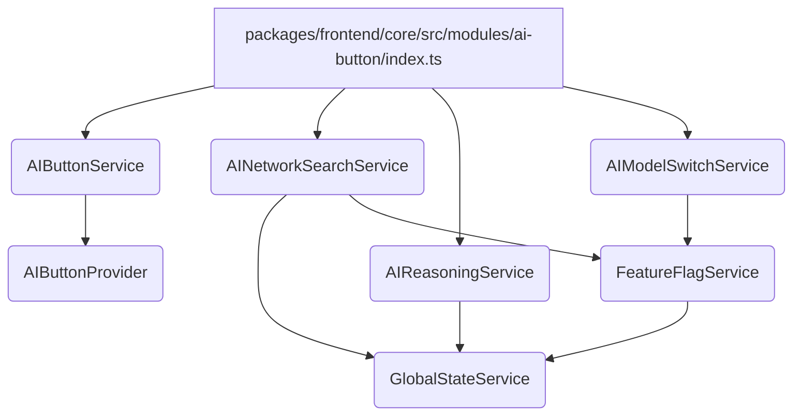

### 分析报告：`packages/frontend/core/src/modules/ai-button/index.ts` 模块

#### 1. 模块概述

[`packages/frontend/core/src/modules/ai-button/index.ts`](packages/frontend/core/src/modules/ai-button/index.ts) 文件是 AFFiNE 前端核心模块中 AI 按钮相关功能的入口和配置中心。它主要负责：

- 导出 AI 按钮的核心提供者 (`AIButtonProvider`) 和服务 (`AIButtonService`)。
- 定义并配置 AI 按钮相关服务的依赖注入，包括 `AIButtonService`、`AINetworkSearchService`、`AIReasoningService` 和 `AIModelSwitchService`。
- 整合 `FeatureFlagService` 和 `GlobalStateService`，以控制 AI 功能的可见性和持久化状态。

该模块遵循 `@toeverything/infra` 框架的依赖注入模式，通过 `framework.service()` 方法注册服务，并指定其依赖。

#### 2. 核心组件分析

##### 2.1 `AIButtonProvider` ([`packages/frontend/core/src/modules/ai-button/provider/ai-button.ts`](packages/frontend/core/src/modules/ai-button/provider/ai-button.ts))

- **功能**: 定义了 AI 按钮的抽象接口，包括 `presentAIButton()` 和 `dismissAIButton()` 两个方法，用于控制 AI 按钮的显示和隐藏。
- **用法**: 这是一个接口定义，具体的实现会在其他地方提供（例如在 UI 层）。`AIButtonService` 会依赖这个 `Provider` 来执行实际的 UI 操作。
- **关键点**: 使用 `createIdentifier` 创建了一个唯一的标识符，用于依赖注入系统识别和提供 `AIButtonProvider` 的实例。

##### 2.2 `AIButtonService` ([`packages/frontend/core/src/modules/ai-button/services/ai-button.ts`](packages/frontend/core/src/modules/ai-button/services/ai-button.ts))

- **功能**: 负责管理 AI 按钮的显示逻辑。它封装了 `AIButtonProvider` 的调用，并引入了防抖 (`throttleTime`) 和排他性映射 (`exhaustMapWithTrailing`) 来优化频繁的显示/隐藏操作。
- **用法**:
  - 通过构造函数注入可选的 `AIButtonProvider` 实例。
  - `presentAIButton` 是一个 `effect`，它监听一个布尔值信号，当信号为 `true` 时调用 `aiButtonProvider.presentAIButton()`，为 `false` 时调用 `aiButtonProvider.dismissAIButton()`。
  - `throttleTime(1000)`: 确保在 1 秒内，即使多次触发 `presentAIButton`，也只处理一次。
  - `exhaustMapWithTrailing`: 确保在前一个 `presentAIButton` 操作完成之前，新的操作不会开始，但会保留最新的操作并在前一个完成后立即执行。
  - `catchError`: 捕获并记录错误，防止操作失败导致应用崩溃。
- **依赖**: `AIButtonProvider` (可选)。

##### 2.3 `FeatureFlagService` ([`packages/frontend/core/src/modules/feature-flag/index.ts`](packages/frontend/core/src/modules/feature-flag/index.ts))

- **功能**: 管理应用中的特性开关（Feature Flags）。它允许动态启用或禁用某些功能，而无需修改和重新部署代码。
- **用法**:
  - 通过 `Flags` 实体和 `GlobalStateService` 来持久化和管理特性开关的状态。
  - 其他服务（如 `AIModelSwitchService` 和 `AINetworkSearchService`）通过访问 `featureFlagService.flags` 来获取特定特性开关的状态。
- **依赖**: `GlobalStateService`。

##### 2.4 `GlobalStateService` ([`packages/frontend/core/src/modules/storage/index.ts`](packages/frontend/core/src/modules/storage/index.ts))

- **功能**: 提供持久化应用状态的能力，通常基于 `localStorage` 或 `IndexedDB` 实现。它允许应用在用户会话之间保存数据。
- **用法**:
  - `AI_NETWORK_SEARCH_KEY` 和 `AI_REASONING_KEY` 等键用于在全局状态中存储 AI 相关功能的启用状态。
  - `watch<boolean>(key)`: 监听特定键值的变化。
  - `set(key, value)`: 设置特定键值。
- **关键点**: `storage` 模块提供了多种存储方案，`GlobalStateService` 是其中用于持久化状态的核心服务。

##### 2.5 `AIModelSwitchService` ([`packages/frontend/core/src/modules/ai-button/services/model-switch.ts`](packages/frontend/core/src/modules/ai-button/services/model-switch.ts))

- **功能**: 管理 AI 模型切换功能的可见性。
- **用法**:
  - 通过 `FeatureFlagService` 的 `enable_ai_model_switch` 特性开关来控制其可见性。
  - `visible` 信号反映了该特性开关的实时状态。
- **依赖**: `FeatureFlagService`。

##### 2.6 `AINetworkSearchService` ([`packages/frontend/core/src/modules/ai-button/services/network-search.ts`](packages/frontend/core/src/modules/ai-button/services/network-search.ts))

- **功能**: 管理 AI 网络搜索功能的启用状态和可见性。
- **用法**:
  - `visible` 信号由 `FeatureFlagService` 的 `enable_ai_network_search` 特性开关控制。
  - `enabled` 信号由 `GlobalStateService` 中 `AI_NETWORK_SEARCH_KEY` 的值控制，允许用户持久化其启用偏好。
  - `setEnabled()` 方法用于更新 `AI_NETWORK_SEARCH_KEY` 的值。
- **依赖**: `GlobalStateService`, `FeatureFlagService`。

##### 2.7 `AIReasoningService` ([`packages/frontend/core/src/modules/ai-button/services/reasoning.ts`](packages/frontend/core/src/modules/ai-button/services/reasoning.ts))

- **功能**: 管理 AI 推理功能的启用状态。
- **用法**:
  - `enabled` 信号由 `GlobalStateService` 中 `AI_REASONING_KEY` 的值控制，允许用户持久化其启用偏好。
  - `setEnabled()` 方法用于更新 `AI_REASONING_KEY` 的值。
- **依赖**: `GlobalStateService`。

#### 3. 模块配置 (`configureAIButtonModule`, `configureAINetworkSearchModule`, `configureAIReasoningModule`, `configureAIModelSwitchModule`)

这些函数是模块的配置入口，它们接收 `Framework` 实例，并使用 `framework.service()` 方法将各个服务注册到依赖注入容器中。

- `configureAIButtonModule`: 注册 `AIButtonService`，并将其 `AIButtonProvider` 作为可选依赖注入。
- `configureAINetworkSearchModule`: 注册 `AINetworkSearchService`，并注入 `GlobalStateService` 和 `FeatureFlagService`。
- `configureAIReasoningModule`: 注册 `AIReasoningService`，并注入 `GlobalStateService`。
- `configureAIModelSwitchModule`: 注册 `AIModelSwitchService`，并注入 `FeatureFlagService`。

#### 4. 模块间结构和关系

该模块的设计体现了清晰的职责分离和依赖注入原则。

- **`index.ts`**: 作为模块的入口，负责协调和配置所有 AI 按钮相关服务。
- **`provider` 目录**: 定义了抽象接口，允许不同的实现插入。
- **`services` 目录**: 包含了具体的业务逻辑服务，它们依赖于 `provider` 或其他核心服务（如 `GlobalStateService` 和 `FeatureFlagService`）。
- **`feature-flag` 和 `storage` 模块**: 作为基础服务，为 AI 按钮模块提供了特性控制和数据持久化的能力。

这种结构使得 AI 按钮功能模块化，易于测试、维护和扩展。通过依赖注入，可以轻松替换不同的 `AIButtonProvider` 实现，或者在不修改核心逻辑的情况下调整特性开关和存储行为。

#### 5. 模块依赖图

**图例说明:**

- **A**: AI 按钮模块的入口文件，负责配置和导出所有相关服务。
- **B, C, D, E**: AI 按钮模块提供的具体服务，分别处理 AI 按钮显示、网络搜索、推理和模型切换。
- **F**: AI 按钮的抽象提供者接口，由 `AIButtonService` 依赖。
- **G**: 全局状态服务，用于持久化数据，被 `AINetworkSearchService` 和 `AIReasoningService` 依赖，也被 `FeatureFlagService` 间接依赖。
- **H**: 特性开关服务，用于控制功能的可见性，被 `AINetworkSearchService` 和 `AIModelSwitchService` 依赖。

这个图清晰地展示了 `ai-button` 模块内部各个服务之间的依赖关系，以及它们如何依赖于 `feature-flag` 和 `storage` 等基础模块。
